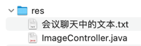

## res


## 会议聊天中的文本

```text
-- -- --

blog, stats:${page.getContent()}

-- -- --

th:text="${blog.title}"

-- -- --

th:href="@{'/blog/' + ${blog.id}}"

-- -- --

th:src="${#strings.isEmpty(blog.cover) ? '/img/cover/default-cover.png' : blog.cover}"

-- -- --

th:class="|border-bottom h-100 pb-5 ${stats.index > 0 ? 'pt-5' : '' } ${ stats.index < 2 ? 'pt-md-0' : '' }|"

-- -- --

<div id="pagination-container" class="mt-3">
    <p class="text-muted p-1">当前第 [[${page.getNumber()+1}]] 页，总计 [[${page.getTotalPages()}]] 页，共 [[${page.getTotalElements()}]] 条记录</p>
    <nav aria-label="Page navigation example">
        <ul class="pagination">
            <li class="page-item" th:if="${page.hasPrevious()}">
                <a class="page-link" href="#" th:href="${'/blog?page=' + page.getNumber()}">Previous</a>
            </li>
            <li th:class="${currentPageNumber == page.getNumber() + 1 ? 'page-item active' : 'page-item'}" class="page-item"
                th:each="currentPageNumber:${#numbers.sequence(1, page.getTotalPages())}">
                <a class="page-link" th:href="${'/blog?page=' + currentPageNumber}" href="#" th:text="${currentPageNumber}">页码</a>
            </li>
            <li class="page-item" th:if="${page.hasNext()}">
                <a class="page-link" href="#" th:href="${'/blog?page=' + (page.getNumber() + 2)}">Next</a>
            </li>
        </ul>
    </nav>
</div>

-- -- --

前台博客列表页面从数据库读取同时支持分页

-- -- --

throw new EntityNotFoundException();

-- -- --

前台博客详情基础功能

-- -- --

https://gitee.com/brooklinlin/sb-blog-2

-- -- --

import '../scss/backend/app.scss';

-- -- --

// test
@import "test";

-- -- --

.just-for-demo {
color: darkgreen;
}

-- -- --

vite.config.js 再增加一个入口，专门给 backend 使用 ...

执行 npm run build

-- -- --

<!-- 通用 CSS -->
<link rel="stylesheet" href="/build/assets/backend.css">

-- -- --

<!-- 通用 JS -->
<script type="module" src="/build/assets/backend.js"></script>

-- -- --

backend/app.html 引入 backend.css 和 backend.js

-- -- --

https://github.com/Tencent/cherry-markdown

-- -- --

npm install cherry-markdown --save

-- -- --

// cherry-markdown
import 'cherry-markdown/dist/cherry-markdown.css';
import Cherry from 'cherry-markdown';
console.log(Cherry.VERSION)

-- -- --

<script type="module">
    const cherryInstance = new Cherry({
      id: 'markdown-container',
      value: '',
    });
</script>

-- -- --

<div id="markdown-container" style="height:600px"></div>

-- -- --

cherry-markdown: 用更 modern 的方式引入 cherry-markdown ...

npm install cherry-markdown --save

https://github.com/Tencent/cherry-markdown

-- -- --

cherry-markdown: 修正新方式引入的图标问题

-- -- --

<dependency>
    <groupId>org.springframework.boot</groupId>
    <artifactId>spring-boot-devtools</artifactId>
    <scope>runtime</scope>
</dependency>

-- -- --

增加依赖 spring-boot-devtools

-- -- --

,
toolbars: {
// 定义顶部工具栏
//toolbar: ['bold','italic','strikethrough','|','color','header','ruby','|','list','panel','detail'],
// 定义侧边栏，默认为空
sidebar: ['theme'],
// 定义顶部右侧工具栏，默认为空
toolbarRight: ['fullScreen', 'export'],
// 定义选中文字时弹出的“悬浮工具栏”，默认为 ['bold', 'italic', 'underline', 'strikethrough', 'sub', 'sup', 'quote', '|', 'size', 'color']
bubble: false,
// 定义光标出现在行首位置时出现的“提示工具栏”，默认为 ['h1', 'h2', 'h3', '|', 'checklist', 'quote', 'table', 'code']
float: false,
}

-- -- --

cherry-markdown: 自定义工具栏

-- -- --

<style id="css">
    /* 覆盖 Cherry Markdown 全屏模式的 z-index */
    .cherry.fullscreen {
      z-index: 1050 !important; /* 确保 z-index 足够大，覆盖其他元素 */
    }
</style>

-- -- --

cherry-markdown: 覆盖全屏模式的 z-index

-- -- --

callback: {
afterChange: (text, html) => {
document.getElementById('content').value = text;
}
},

-- -- --

cherry-markdown: 增加 callback.afterChange 配置 ...

每次 markdown 编辑器内容变化时都会更新 name=content 的 textarea 这个 input，确保后端可以正确获取博客内容

-- -- --

fileUpload: (file, callback) => {
const formData = new FormData();
formData.append('image', file);
fetch('/backend/images/uploadFromMd', {
method: 'POST',
body: formData
})
.then(response => response.json())
.then(data => {
if (data.success) {
callback(data.file.url);
} else {
console.error('图片上传失败:', data.message);
alert('图片上传失败: ' + data.message);
}
})
.catch(error => {
console.error('图片上传出错:', error);
alert('图片上传出错，请稍后重试');
});
},

-- -- --

custom.upload.from-md-path=md

-- -- --

cherry-markdown: 增加 fileUpload 配置，支持文件上传

-- -- --

fragment

-- -- --

重构：抽取通用代码到 backend/fragment.html

-- -- --

<div id="markdown-container" style="height:600px"></div>

-- -- --

cherry-markdown: 编辑页面也支持 markdown 编辑器

-- -- --

document.getElementById('content').value

-- -- --

cherry-markdown: value 的初始值改从 document.getElementById('content').value 获取
```
