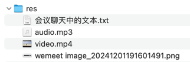

## res


## 会议聊天中的文本

```text
toolbar: ['bold', 'italic', 'strikethrough', '|', 'color', 'header', '|', 'list', 'detail', 'panel',
                {insert: ['image', 'audio', 'video', 'link', 'hr', 'code', 'table']},
                'undo', 'search', 'settings'
            ]

-- -- --

cherry-markdown: 调整工具栏，去除非必须的功能

-- -- --

博客详情页面去除右侧区域

-- -- --

<div id="css">
    <link rel="stylesheet" href="/build/assets/backend.css">
</div>

-- -- --

<div id="js">
    <script type="module" src="/build/assets/backend.js"></script>
    <script>
        document.addEventListener('DOMContentLoaded', function() {
            const cherry = new Cherry({
                id: 'blog-content',
                value: document.getElementById('blog-content').dataset.content,
                editor: {
                    defaultModel: 'previewOnly',
                },
                toolbars: {
                    // 打开侧边目录
                    toc: {
                        updateLocationHash: true,
                        defaultModel: 'pure',
                    },
                }
            });
        });
    </script>
</div>

-- -- --

 id="blog-content"

-- -- --

th:data-content="${blog.content}"

-- -- --

博客详情页面使用纯预览的方式展示 markdown 内容

-- -- --

<style>
    .cherry {
        height: unset;
        /*box-shadow: none;*/
    }
    .cherry-markdown a.anchor:before {
        content: "";
    }
    .cherry-markdown img {
        width: 100% !important;
    }
    .cherry-markdown video {
        width: 100% !important;
    }
</style>

-- -- --

cherry-markdown: 覆盖博客详情页面的 markdown 样式

-- -- --

博客详情页面细节调整：正文区域去除动画效果

-- -- --

, previewer: {
    enablePreviewerBubble: false,
}

-- -- --

position: 'fixed',

-- -- --

博客详情页面细节调整：enablePreviewerBubble: false

-- -- --

博客详情页面细节调整：设置 toc 的 position: 'fixed'

-- -- --

https://gitee.com/brooklinlin/sb-blog-2

-- -- --

String description;

-- -- --

Blog 增加 description 字段

-- -- --

<dependency>
    <groupId>org.projectlombok</groupId>
    <artifactId>lombok</artifactId>
    <scope>annotationProcessor</scope>
</dependency>

-- -- --

Blog 删除之前写的 Getter and Setter、toString，引入 Lombok ...

@NoArgsConstructor
@Getter
@Setter
@ToString

IDEA - Enable annotation processing

-- -- --

<div class="form-group">
  <label for="content">博客描述</label>
  <textarea class="form-control" name="description" id="description" cols="30" rows="5"></textarea>
</div>

-- -- --

<div class="form-group">
  <label for="content">博客描述</label>
  <textarea class="form-control" name="description" id="description" cols="30" rows="5" th:text="${blog.description}"></textarea>
</div>

-- -- --

博客后台管理页面增加处理 description 字段

-- -- --

<p class="mt-2 text-muted" th:text="${blog.description}"></p>


-- -- --

博客列表页面显示 description

-- -- --

    LocalDateTime created_at;

    @Nullable
    LocalDateTime updated_at;

-- -- --

BlogDTO

-- -- --

Long id;
String title;
String content;
String cover;
String description;

-- -- --

<dependency>
    <groupId>org.springframework.boot</groupId>
    <artifactId>spring-boot-starter-validation</artifactId>
</dependency>

-- -- --

@Valid

-- -- --

BindingResult result

-- -- --

if (result.hasErrors()) {
    return "....";
}

-- -- --

<div class="form-group">
  <label for="title">博客标题</label>
  <input th:field="*{title}" type="text" class="form-control" th:class="|form-control ${#fields.hasErrors('title') ? 'is-invalid' : ''}|" id="title" name="title" placeholder="请输入博客标题">
  <span th:if="${#fields.hasErrors('title')}" class="error invalid-feedback" th:errors="*{title}"></span>
</div>
<div class="form-group">
  <label for="content">博客内容</label>
  <textarea class="form-control d-none" name="content" id="content" cols="30" rows="10" th:utext="*{content}"></textarea>
  <div id="markdown-container" style="height:600px" th:class="${#fields.hasErrors('content') ? 'form-control is-invalid' : ''}"></div>
  <span th:if="${#fields.hasErrors('content')}" class="error invalid-feedback" th:errors="*{content}"></span>
</div>
<div class="form-group">
  <label for="content">博客描述</label>
  <textarea class="form-control" th:class="|form-control ${#fields.hasErrors('description') ? 'is-invalid' : ''}|" name="description" id="description" cols="30" rows="5" th:field="*{description}"></textarea>
  <span th:if="${#fields.hasErrors('description')}" class="error invalid-feedback" th:errors="*{description}"></span>
</div>

-- -- --

 th:object="${blog}"

-- -- --

@ModelAttribute("blog")

-- -- --

model.addAttribute("blog", new Blog());

-- -- --

DTO、@Valid、BindingResult、spring-boot-starter-validation

-- -- --

blog-form-items

-- -- --

<div th:replace="~{backend/fragment :: #blog-form-items}"></div>

-- -- --

抽取表单通用代码

-- -- --

<input type="hidden" name="id" th:value="${id}">

-- -- --

上一步抽取的表单通用代码 - 增加隐藏的 id 表单项

-- -- --

博客编辑页面重用之前抽取的表单通用代码

-- -- --

博客编辑页面重用之前抽取的表单通用代码，同时后端增加校验

-- -- --

service

-- -- --

Blog blog = new Blog();

if (blogDTO.getId() != null) {
    blog = blogRepository.findById(blogDTO.getId()).get();
    blog.setUpdated_at(LocalDateTime.now());
} else {
    blog.setCreated_at(LocalDateTime.now());
}

blog.setTitle(blogDTO.getTitle());
blog.setContent(blogDTO.getContent());
blog.setDescription(blogDTO.getDescription());
blog.setCover(blogDTO.getCover());
```
