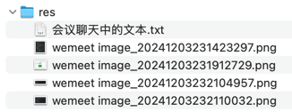

## res


## 会议聊天中的文本

```text
重构：Controller 层彻底不再直接调用 DAO (Data Access Object) 层

-- -- --

重构：controller、service、dao、entity

-- -- --

详情页面显示创建时间

-- -- --

${#temporals.format(blog.created_at, 'yyyy-MM-dd HH:mm:ss')}

-- -- --

详情页面显示创建时间 - 调整时间格式

-- -- --

列表页面显示创建时间

-- -- --

https://gitee.com/iae23a12/sb-blog

-- -- --

sb-detail

-- -- --

<packaging>pom</packaging>

-- -- --

删除 src 目录同时在 pom.xml 中指定 packaging = pom ...

当父项目用，不需要代码，后续主要在它下面建子模块

-- -- --

day241203-before-spring

-- -- --

在 sb-detail 下新建子项目/子Module ...

观察父子的 pom.xml 直接的关键信息
父：modules
子：parent

... 它们之前的其他关联，后续遇到了展开介绍

-- -- --

MyApplication

-- -- --

在新建的子模块中增加入口类 MyApplication

-- -- --

System.out.println("已经将 blog 保存到「数据库」 - " + blog);

-- -- --

System.out.println("我...视而不见");

-- -- --

// 调用 Repository 之前可能做一些其他的操作，比如记录日志等
SimpleBlogRepository simpleBlogRepository = new SimpleBlogRepository();
simpleBlogRepository.save(blog);
// 调用 Repository 之后也可能做一些其他的操作，比如统计等...

-- -- --

// 调用 Repository 之前可能做一些其他的操作，比如记录日志等...
NopeBlogRepository nopeBlogRepository = new NopeBlogRepository();
nopeBlogRepository.save(blog);
// 调用 Repository 之后也可能做一些其他的操作，比如统计等...

-- -- --

SimpleBlogService simpleBlogService = new SimpleBlogService();
simpleBlogService.save(blog);

-- -- --

模拟之前的核心业务逻辑 controller -> service -> dao

-- -- --

复习：面向抽象编程，多态

-- -- --

切换具体的 BlogService 实现类

-- -- --

// 这里只是简单举了一个小例子 - 切换 BlogController 中依赖的具体 BlogService 实现类
// 其他地方也可能需要切换，如：BlogService 依赖的具体 BlogRepository 实现类
// ... 真实项目要切换的地方可能很多
// 思考：如何在不修改 .java 源代码的方式，实现自由切换？

-- -- --

分析并思考

-- -- --

// 思路提醒：现在是“自己 new” => 能否“让别人 new 好给我直接用”，现实中有很多这样的需求和例子

-- -- --

思路提醒：自己 new => 别人 new 好给我直接用

-- -- --

// 解决方法有很多，先参考 Spring 给出的解决方案
// 回顾之前看到的一张图：https://docs.spring.io/spring-framework/reference/core/beans/basics.html

-- -- --

参考 Spring 给出的解决方案

-- -- --

day241203-spring-quickstart

-- -- --

创建新 Module - spring-quickstart

-- -- --

复制上一个 Module 的例子代码

-- -- --

改造代码：目的是不再自己new，那得 ...

对外开放一些窗口，方便别人传给你，
开放方式之一：构造器

-- -- --

改造代码：同理，让具体的 BlogService 也对外开放窗口 ...

方便别人传递它需要的具体 BlogRepository 依赖

-- -- --

测试：现在可以按需自由组装了，但是 ...

还没有实现完全不修改 .java 代码的需求

-- -- --

<dependencies>
    <!-- https://mvnrepository.com/artifact/org.springframework/spring-context -->
    <dependency>
        <groupId>org.springframework</groupId>
        <artifactId>spring-context</artifactId>
        <version>6.2.0</version>
    </dependency>

</dependencies>

-- -- --

beans.xml

-- -- --

<?xml version="1.0" encoding="UTF-8"?>
<beans xmlns="http://www.springframework.org/schema/beans"
       xmlns:xsi="http://www.w3.org/2001/XMLSchema-instance"
       xsi:schemaLocation="http://www.springframework.org/schema/beans
		https://www.springframework.org/schema/beans/spring-beans.xsd">

    
</beans>

-- -- --

simpleBlogRepository

-- -- --

ClassPathXmlApplicationContext applicationContext = new ClassPathXmlApplicationContext("beans.xml");

-- -- --

改从 Spring IoC container 获取需要的对象 ...

Configuration Metadata + Your Business Objects = Fully configured system Ready for Use

也解释了为什么叫 Inversion of Control (IoC)，原来是自己需要什么自己 new 什么，现在不自己 new 了，改从容器获取，new 的控制权交出去了

-- -- --

测试：真正不改 .java 源代码的情况下，灵活的实现依赖切换

-- -- --

// 现在可以去看看之前的 sb-blog 项目，猜猜哪里能找到 IoC 容器

-- -- --

下一步：可以去看看之前的 sb-blog 项目，猜猜哪里能找到 IoC 容器
```
