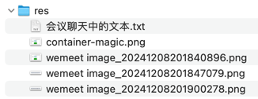

## res


## 会议聊天中的文本

```text
回顾之前看过一点的 Spring 一手资源 ...

https://docs.spring.io/spring-framework/reference/overview.html

-- -- --

day241208-spring-annotation-2

-- -- --

复习 XML-based Configuration Metadata

-- -- --

复习 Annotation-based Configuration Metadata

-- -- --

复习 DI - Dependency Injection 之构造器注入 - xml ...

Dependency injection (DI)
Constructor-based Dependency Injection

https://docs.spring.io/spring-framework/reference/core/beans/dependencies/factory-collaborators.html

-- -- --

复习 DI - Dependency Injection 之构造器注入 - 注解

-- -- --

https://docs.spring.io/spring-framework/reference/core/beans/annotation-config/autowired.html

-- -- --

DI - Setter-based dependency injection

-- -- --

AnnotationBasedAppTest

-- -- --

XMLBasedAppTest

-- -- --

重构：IoCTest 拆分成两个测试类

-- -- --

initApplicationContext

-- -- --

单元测试：@BeforeAll

-- -- --

day241208-summer

-- -- --

创建新 Module - summer，模拟 Spring 的核心概念

-- -- --

MyIoCTest

-- -- --

MyBeanFactory

-- -- --

MyClassPathXmlApplicationContext

-- -- --

模拟 Spring IoC 容器 - 基础代码

-- -- --

String path = this.getClass().getClassLoader().getResource(configLocation).getPath();

-- -- --

Document document = Jsoup.parse(new File(path), "UTF-8");

-- -- --

模拟 Spring IoC 容器 - 基础代码

-- -- --

// 这里先简单模拟只有一个参数的情况

-- -- --

模拟 Spring IoC 容器 - MyClassPathXmlApplicationContext 支持构造器依赖注入

-- -- --

if (map.isEmpty()) {
            return null;
        }

        return map.keySet().toArray(String[]::new);

-- -- --

模拟 Spring IoC 容器 - 增加 containsBean、getBeanDefinitionNames 方法

-- -- --

https://gitee.com/i-really-like-quietness/sb-detail

-- -- --

proxy

-- -- --

Flyable

-- -- --

Girl

-- -- --

System.out.println("Believe me I can fly, I am singing in the sky...");

-- -- --

挥着翅膀的女孩

-- -- --

Thread.sleep(new Random().nextInt(2 * 1000));

-- -- --

模拟 AOP - 基础代码

-- -- --

模拟 AOP - 统计方法执行时间 - 最直观的写法

-- -- --

 // 思考：假设没办法修改 Girl 的源代码，又该如何做？(如：它是来自别人编译好的 jar 包中的类)

-- -- --

模拟 AOP - 统计方法执行时间 - 思考

-- -- --

模拟 AOP - 统计方法执行时间 - extends

-- -- --

Girl3 跟目标对象实现同样的接口（代理她）

-- -- --

从另一个角度来看，这种方式叫“聚合”，上一种方式叫“继承”

-- -- --

模拟 AOP - 统计方法执行时间 - implements

-- -- --

思考：见 commit 消息

-- -- --

模拟 AOP - 思考：哪种实现方式更好 ...

同时再思考：如果不止记录目标方法的运行时间，还想在执行目标方法之前增加其他的功能，比如记录日志、权限检查等... 该如何实现？

-- -- --

GirlTimerProxy

-- -- --

模拟 AOP - Girl3 改名成 GirlTimerProxy

-- -- --

GirlLoggingProxy

-- -- --

System.out.println("用户 admin 开始访问该方法，地点：xm，时间：" + LocalDateTime.now());

-- -- --

System.out.println("用户 admin 结束访问该方法，地点：xm，时间：" + LocalDateTime.now());

-- -- --

模拟 AOP - 增加 GirlLoggingProxy

-- -- --

@Test
@DisplayName("即统计时间，也记录日志（先时间、再日志）")
void testGirlTimerAndLogging() {
    // todo 思考：如何实现“即记录日志，也统计时间”的功能
    // 同时思考：如何灵活的调整“记录日志”和“统计时间”的顺序
}

-- -- --

模拟 AOP - 思考 - 见代码注释

-- -- --

模拟 AOP - 代理的目标改成接口类型

-- -- --

模拟 AOP - 即统计时间，也记录日志（先日志、再时间）

-- -- --

模拟 AOP - 即统计时间，也记录日志（先时间、再日志）

-- -- --

// 思考1：如果被代理的对象不止一个方法，还有10个其他方法，或者未知个数的方法；
    // 思考2：再往外走一层，如果想代理的对象不止 Girl/Flyable，还是10个其他的类型，或者任何类型的对象；
    // 又该如何处理，如何灵活的处理

-- -- --

MyProxy

-- -- --

模拟 AOP - 继续思考 - 见代码注释

-- -- --

public static Object newProxyInstance() {
        return null;
    }

-- -- --

@Test
    @DisplayName("测试动态代理")
    void testDynamicProxy() {
        Flyable flyable = (Flyable) MyProxy.newProxyInstance();

        flyable.fly();
    }

-- -- --

模拟 AOP - 动态代理 - 轮廓 (error)

-- -- --

sourceCode

-- -- --

String userDir = System.getProperty("user.dir");
        System.out.println(userDir);

-- -- --

String fileName = userDir + "/src/main/java/com/example/proxy/GirlLoggingProxy2.java";
        File file = new File(fileName);
        try (FileWriter fw = new FileWriter(file)) {
            fw.write(sourceCode);
        }

-- -- --

// compile
            JavaCompiler compiler = ToolProvider.getSystemJavaCompiler();
            StandardJavaFileManager standardFileManager = compiler.getStandardFileManager(null, null, null);
            Iterable<? extends JavaFileObject> javaFileObjects = standardFileManager.getJavaFileObjects(fileName);
            JavaCompiler.CompilationTask task = compiler.getTask(null, standardFileManager, null, null, null, javaFileObjects);
            task.call();
            standardFileManager.close();

-- -- --

// load to memory
        URL[] urls = new URL[] {new URL("file:/" + userDir + "/src/")};
        URLClassLoader urlClassLoader = new URLClassLoader(urls);
        Class<?> aClass = urlClassLoader.loadClass("com.example.proxy.GirlLoggingProxy2");
        System.out.println(aClass);

        // create an instance
        Constructor<?> declaredConstructor = aClass.getDeclaredConstructor(Flyable.class);
        Flyable flyable = (Flyable) declaredConstructor.newInstance(new Girl());
        
        return flyable;

-- -- --

模拟 AOP - 动态代理 - MyProxy 类实现生成代理对象 newProxyInstance

-- -- --

%s

-- -- --

模拟 AOP - 动态代理 - 把要代理的接口类型也传进去

-- -- --

methodsString

-- -- --

模拟 AOP - 动态代理 - 支持代理所有方法 (暂时忽略方法参数)
```
