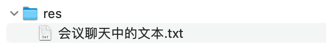

## res


## 会议聊天中的文本

```text
requestURI

-- -- --

HttpServletRequest request

-- -- --

advice.GlobalControllerAdvice

-- -- --

@ControllerAdvice

-- -- --

@ModelAttribute("requestURI")
    String getRequestServletPath(HttpServletRequest request) {
        return request.getRequestURI();
    }

-- -- --

后台管理的左侧菜单动态高亮 - 优化 equals -> startsWith

-- -- --

前台的导航菜单也增加动态高亮功能

-- -- --

前台导航栏的 logo 链接到首页

-- -- --

<dependency>
            <groupId>org.springframework.boot</groupId>
            <artifactId>spring-boot-starter-security</artifactId>
        </dependency>

-- -- --

Add Spring Security dependency

只需引入 `spring-boot-starter-security` 即可获得很多默认功能
https://docs.spring.io/spring-security/reference/servlet/getting-started.html

-- -- --

自定义 spring-security 的默认用户名和密码 - 配置文件

-- -- --

config.SecurityConfiguration

-- -- --

@Bean
    public PasswordEncoder passwordEncoder() {
        return new BCryptPasswordEncoder();
    }

-- -- --

@Bean
    public UserDetailsService userDetailsService() {
        UserDetails user = User
                .withUsername("user")
                .password(passwordEncoder().encode("password"))
                .roles("user")
                .build();

        UserDetails admin = User
                .withUsername("admin")
                .password(passwordEncoder().encode("password"))
                .roles("admin", "user")
                .build();

        return new InMemoryUserDetailsManager(user, admin);
    }

-- -- --

自定义 spring-security 的默认用户名和密码 - 配置类

-- -- --

自定义 spring-security 的默认用户名和密码 - 配置类

-- -- --

submit

-- -- --

覆盖 spring-security 自带的登录页面 - 需配合下个 commit

-- -- --

@Bean
    public SecurityFilterChain filterChain(HttpSecurity http) throws Exception {
        http
                .formLogin(
                        form -> form.loginPage("/login")
                )
                .authorizeHttpRequests(authorizeRequests -> authorizeRequests
                        .requestMatchers( "/login", "/assets/**", "/build/**", "/img/**", "/vendor/**").permitAll()
                        .anyRequest().authenticated()
                )
        ;
        return http.build();
    }

-- -- --

覆盖 spring-security 自带的登录页面 - 增加 SecurityFilterChain 配置

-- -- --

th:action="@{/login}"

-- -- --

覆盖 spring-security 自带的登录页面 - 用户名/密码表单的名称配置

-- -- --

            <p class="text-primary" th:if="${param.error}">Invalid username and password.</p>


-- -- --

显示登录错误信息

-- -- --

<dependency>
            <groupId>org.thymeleaf.extras</groupId>
            <artifactId>thymeleaf-extras-springsecurity6</artifactId>
        </dependency>

-- -- --

 xmlns:sec="http://www.thymeleaf.org/thymeleaf-extras-springsecurity6"

-- -- --

<li sec:authorize="isAuthenticated()" class="nav-item dropdown">
                    <a id="navbarDropdown" class="nav-link dropdown-toggle" href="#" role="button" data-bs-toggle="dropdown" aria-haspopup="true" aria-expanded="false">
                        <span sec:authentication="name">xx-name</span> <span class="caret"></span>
                    </a>

                    <div class="dropdown-menu dropdown-menu-right" aria-labelledby="navbarDropdown">
                        <a class="dropdown-item" href="#"
                           onclick="event.preventDefault();">
                            退出
                        </a>
                    </div>
                </li>
                <li sec:authorize="!isAuthenticated()" class="nav-item"><a href="/login" class="btn btn-sm btn-primary transition-3d-hover my-3 my-lg-0">登录</a></li>

-- -- --

show authentication name + check isAuthenticated ...

<dependency>
    <groupId>org.thymeleaf.extras</groupId>
    <artifactId>thymeleaf-extras-springsecurity6</artifactId>
</dependency>

xmlns:sec="thymeleaf-extras-springsecurity6";

sec:authentication="name"

sec:authorize="isAuthenticated()"

-- -- --

xmlns:sec="http://www.thymeleaf.org/thymeleaf-extras-springsecurity6"

-- -- --

<li class="nav-item dropdown user-menu">
        <a href="#" class="nav-link dropdown-toggle" data-toggle="dropdown" aria-expanded="false">
          
          <span sec:authentication="name" class="d-none d-md-inline">xx_name</span>
        </a>
        <ul class="dropdown-menu dropdown-menu-lg dropdown-menu-right" style="left: inherit; right: 0px;">
          <!-- User image -->
          <li class="user-header bg-gray-light">
            
            <p sec:authentication="name">
              xx_name
            </p>
          </li>
          <!-- Menu Footer-->
          <li class="user-footer">
            <a href="#" class="btn btn-default btn-flat">Profile</a>
            <a href="#" class="btn btn-default btn-flat float-right">
              退出
            </a>
          </li>
        </ul>
      </li>

-- -- --

后台的 backend/app.html 也增加显示用户信息

-- -- --

.logout((logout) -> logout
                        .logoutUrl("/logout")
                        .logoutSuccessUrl("/")
                )

-- -- --

document.getElementById('logout-form').submit();

-- -- --

<form id="logout-form" action="#" th:action="@{/logout}" method="post" style="display: none;"></form>

-- -- --

logout

-- -- --

<a sec:authorize="hasRole('admin')" class="dropdown-item" href="#" th:href="@{/backend}">
                            后台管理
                        </a>

-- -- --

hasRole('admin') - 前端判断

-- -- --

.requestMatchers("/backend/**").hasRole("admin")

-- -- --

hasRole('admin') - 后端校验

-- -- --

修改默认的 session 超时时间

-- -- --

server.servlet.session.timeout=1m

-- -- --

<input class="form-check-input" type="checkbox" name="remember-me" id="remember-me" >
                <label class="form-check-label" for="remember-me">记住我</label>

-- -- --

.rememberMe(rm -> rm.rememberMeParameter("remember-me"))

-- -- --

remember me ...

观察浏览器的 cookie

-- -- --

private Long id;
    private String name;
    private String password;
    private String email;
    private String phone;
    private LocalDateTime createdAt;
    private boolean enabled;

-- -- --

@Id
    @GeneratedValue(strategy= GenerationType.IDENTITY)

-- -- --

UserRepository

-- -- --

Optional<User> findFirstByName(String name);

-- -- --

UserRepositoryTest

-- -- --

@SpringBootTest

-- -- --

@Autowired
    UserRepository userRepository;
    @Autowired
    PasswordEncoder passwordEncoder;

-- -- --

User user = new User();
        String userName = "test";
        user.setName(userName);
        user.setPassword(passwordEncoder.encode("password"));
        user.setEnabled(true);

        userRepository.save(user);

-- -- --

Optional<User> optionalUser = userRepository.findFirstByName(userName);
        Assertions.assertTrue(optionalUser.isPresent());

-- -- --

User + UserRepository + xxxTest ...

@Entity + @Repository
```
