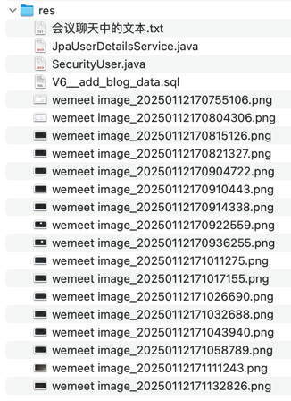

## res


## 会议聊天中的文本

```text
private String name;
    private String password;
    private String email;
    private String phone;
    private LocalDateTime createdAt;
    private boolean enabled;

-- -- --

在 Role 中增加 @ManyToMany 注解，表示 Role 和 Permission 是多对多关系

-- -- --

可以省略的 @JoinTable 注解

-- -- --

在 User 中增加 @ManyToMany 注解，表示 User 和 Role 的多对多关系

-- -- --

mobile

-- -- --

User 实体的 phone 改成 mobile

-- -- --

注释 spring.jpa.hibernate.ddl-auto 配置

-- -- --

<dependency>
            <groupId>org.flywaydb</groupId>
            <artifactId>flyway-core</artifactId>
        </dependency>
        <dependency>
            <groupId>org.flywaydb</groupId>
            <artifactId>flyway-mysql</artifactId>
        </dependency>

-- -- --

migration

-- -- --

-- schema
create table blog
(
    id          bigint auto_increment primary key,
    title       varchar(255) null COMMENT '标题',
    content     text null COMMENT '正文',
    description varchar(255) null COMMENT '描述',
    cover       varchar(255) null COMMENT '封面图地址',
    created_at  datetime(6)  null COMMENT '创建时间',
    updated_at  datetime(6)  null COMMENT '更新时间'
) COMMENT '博客表';

-- -- --

-- schema
create table user
(
    id         bigint auto_increment primary key,
    name       varchar(255) null COMMENT '用户名',
    password   varchar(255) null COMMENT '密码',
    email      varchar(255) null COMMENT '邮箱',
    mobile     varchar(255) null COMMENT '手机',
    enabled    bit(1) not null DEFAULT b'1' COMMENT '是否启用',
    created_at datetime(6)  null COMMENT '创建时间'
) COMMENT '用户表';

-- -- --

-- schema

-- role
CREATE TABLE `role`
(
    `id`          bigint NOT NULL AUTO_INCREMENT,
    `name`        varchar(255)    DEFAULT NULL COMMENT '角色名称',
    `description` varchar(255)    DEFAULT NULL COMMENT '角色描述',
    `sort`        int    NOT NULL DEFAULT '0' COMMENT '角色顺序',
    PRIMARY KEY (`id`)
) COMMENT='角色表';


-- permission
CREATE TABLE `permission`
(
    `id`          bigint NOT NULL AUTO_INCREMENT,
    `name`        varchar(255) DEFAULT NULL COMMENT '权限名称',
    `description` varchar(255) DEFAULT NULL COMMENT '权限描述',
    `sort`        int    NOT NULL COMMENT '权限顺序',
    PRIMARY KEY (`id`)
) COMMENT='权限表';

-- role has permissions
create table role_permissions
(
    role_id       bigint not null,
    permission_id bigint not null,
    primary key (role_id, permission_id),
    constraint FKh0v7u4w7mttcu81o8wegayr8e
        foreign key (permission_id) references permission (id),
    constraint FKlodb7xh4a2xjv39gc3lsop95n
        foreign key (role_id) references role (id)
) COMMENT='角色和权限关联表';

-- user has roles
create table user_roles
(
    user_id bigint not null,
    role_id bigint not null,
    primary key (user_id, role_id),
    constraint FK55itppkw3i07do3h7qoclqd4k
        foreign key (user_id) references user (id),
    constraint FKrhfovtciq1l558cw6udg0h0d3
        foreign key (role_id) references role (id)
) COMMENT='用户和角色关联表';

-- -- --

引入 flyway

-- -- --

-- data
INSERT INTO `user` (`id`, `name`, `password`, `email`, `mobile`, `enabled`)
VALUES (1, 'admin', '$2a$10$X/uMNuiis.fyO47cxbta3OSs2sllSeLcwVfC0.ghyxeVVZRmAbzk2', 'admin@example.com', NULL, b'1'),
       (2, 'editor', '$2a$10$X/uMNuiis.fyO47cxbta3OSs2sllSeLcwVfC0.ghyxeVVZRmAbzk2', 'editor@example.com', NULL, b'1'),
       (3, 'user', '$2a$10$X/uMNuiis.fyO47cxbta3OSs2sllSeLcwVfC0.ghyxeVVZRmAbzk2', 'user@example.com', NULL, b'1');

-- -- --

-- data
INSERT INTO `role` (`id`, `name`, `description`, `sort`)
VALUES
	(1, 'admin', '管理员', 0),
	(2, 'editor', '编辑', 0),
	(3, 'user', '普通用户', 0);

INSERT INTO `permission` (`id`, `name`, `description`, `sort`)
VALUES
	(1, '/backend','Dashboard__far fa-circle', 1),
	(2, '/backend/blog', '博客管理__far fa-copy', 2),
	(3, '/backend/user', '用户管理__fas fa-users', 3);

-- 给角色分配权限
INSERT INTO `role_permissions` (`role_id`, `permission_id`)
VALUES
	(1, 1),
	(1, 2),
	(1, 3),
	(2, 1),
	(2, 2);

-- 给用户分配角色
INSERT INTO `user_roles` (`user_id`, `role_id`)
VALUES
    (1, 1),
    (2, 2),
    (3, 3);

-- -- --

md-cover.png

-- -- --

&serverTimezone=Asia/Shanghai

-- -- --

修正数据库时区配置 serverTimezone=Asia/Shanghai

-- -- --

@JoinTable(
            name = "user_roles",
            joinColumns = @JoinColumn(name = "user_id", referencedColumnName="id"),
            inverseJoinColumns = @JoinColumn(name = "role_id", referencedColumnName="id")
    )

-- -- --

Set<String> permissionNames = new HashSet<>();
        for (Permission permission : permissions) {
            permissionNames.add(permission.getName());
        }

-- -- --

@Bean
    public DaoAuthenticationProvider authenticationProvider() {
        DaoAuthenticationProvider authenticationProvider = new DaoAuthenticationProvider();
        authenticationProvider.setUserDetailsService(jpaUserDetailsService);
        authenticationProvider.setPasswordEncoder(passwordEncoder());
        return authenticationProvider;
    }

-- -- --

DaoAuthenticationProvider

+ SecurityUser
+ JpaUserDetailsService

-- -- --

https://gitee.com/i-really-like-quietness/sb-blog-2
```
