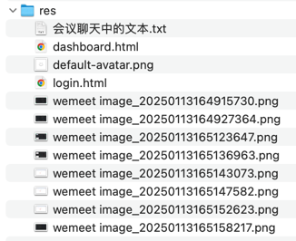

## res


## 会议聊天中的文本

```text
anyRequest().permitAll() except "/backend/**"

-- -- --

<dependency>
            <groupId>org.webjars.npm</groupId>
            <artifactId>bootstrap-icons</artifactId>
            <version>1.11.3</version>
        </dependency>

-- -- --

https://docs.spring.io/spring-boot/reference/web/servlet.html#web.servlet.spring-mvc.static-content

-- -- --

.user-center {
    .nav-link.active {
        color: $primary;
    }

    .nav-item i.bi {
        margin-right: .5rem;
    }
}

-- -- --

  <link id="css" rel="stylesheet" href="/webjars/bootstrap-icons/1.11.3/font/bootstrap-icons.min.css"></link>


-- -- --

<i class="bi bi-info-circle"></i>

-- -- --

bootstrap-icons webjars ...

https://docs.spring.io/spring-boot/reference/web/servlet.html#web.servlet.spring-mvc.static-content

-- -- --

重构：在通用模板 app.html 中引入 bootstrap-icons 样式

-- -- --

.nav-item {
    a.nav-link i {
      margin-right: 0.5rem;
    }
  }

-- -- --

重构：svg -> i 同时在 header.scss 中统一配置图标间距

-- -- --

Method Security

@EnableMethodSecurity

@PreAuthorize("isAuthenticated()")

https://docs.spring.io/spring-security/reference/servlet/authorization/method-security.html

-- -- --

.font-size-12 {
  font-size: .75rem;
}

-- -- --

重构：美化登录页面

-- -- --

register

-- -- --

redirect

-- -- --

实现
```
