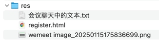

## res


## 会议聊天中的文本

```text
fillUsernameFromEmail

-- -- --

https://www.thymeleaf.org/doc/tutorials/3.1/usingthymeleaf.html

-- -- --

existingUser

-- -- --

userDashboardWihoutLogin

-- -- --

<dependency>
    <groupId>org.springframework.security</groupId>
    <artifactId>spring-security-test</artifactId>
</dependency>

-- -- --

userRegisterWithExistingEmail

-- -- --

添加多环境配置文件 ...

通过环境配置文件分离，实现开发、测试、生产环境的差异化配置，提高部署灵活性和安全性

.gitignore 忽略 -dev 等不需要提交到版本控制的配置文件

-- -- --

non-existent

-- -- --

success

-- -- --

<div th:if="${success}" class="alert alert-success"><span th:text="${success}"></span></div>

-- -- --

<dependency>
    <groupId>org.springframework.boot</groupId>
    <artifactId>spring-boot-starter-mail</artifactId>
</dependency>

-- -- --

smtp.qq.com

-- -- --

587

-- -- --

spring.mail.host=smtp.qq.com
spring.mail.port=587
spring.mail.username=替换为自己的邮箱
spring.mail.password=替换为自己申请的授权码
spring.mail.properties.mail.smtp.auth=true
spring.mail.properties.mail.smtp.starttls.enable=true
```
