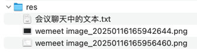

## res


## 会议聊天中的文本

```text
/user/do-password-reset

-- -- --

confirmPassword

-- -- --

CREATE TABLE `password_reset_token`
(
    `id`              bigint       NOT NULL AUTO_INCREMENT,
    `token`           varchar(255) NOT NULL COMMENT '重置密码 token',
    `user_id`         bigint DEFAULT NULL COMMENT 'token 所属的用户 ID',
    `expiration_date` datetime(6) NOT NULL COMMENT '过期时间',
    `created_at` datetime(6) NOT NULL COMMENT '生成时间',
    PRIMARY KEY (`id`),
    UNIQUE KEY (`token`),
    CONSTRAINT FOREIGN KEY (`user_id`) REFERENCES `user` (`id`)
);

-- -- --

__password_reset_token.sql

-- -- --

提醒：“创建新的分支”写自己的代码

-- -- --

1.消化吸收
2.纸质笔记 前端->C->S->R 以及相对应的细节
3.把个人主页更改为 Spring Boot 的形式
4.开始对自己所想要制作的项目进行构思，着手开始写代码
```
