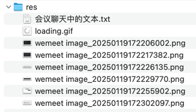

## res


## 会议聊天中的文本

```text

expireThisToken

-- -- --

@Query(value = "update PasswordResetToken prt set prt.expirationDate=CURRENT_TIMESTAMP() where prt.token = :token")

-- -- --

expireThisToken after password-reset

-- -- --

Just Do It
别只停留在想的阶段
大胆、快速跨出第一步
有了第一步，后面想停都不太方便了
第一步附带的推动力，自然会推着你继续往前走
提醒：在新分支上写作业，大胆的写。不会影响到主分支

-- -- --

// loading
const blogContent = document.getElementById('blog-content');
const observer = new MutationObserver(() => {
    let loadingDiv = document.getElementById('loading');
    if (loadingDiv) {
        loadingDiv.remove();
    }
});
observer.observe(blogContent, { childList: true });

-- -- --

优化：博客详情页面增加 loading 效果

-- -- --

.nav-link {
    color: #212529;
}

-- -- --

/user/create-your-blog
```
