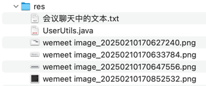

## res


## 会议聊天中的文本

```text
增加 UserUtils 工具类，提供 getCurrentUser() 快速获取当前登录用户

-- -- --

public static Boolean isAdmin() {
    return getCurrentSecurityUser().getAuthorities().stream()
            .anyMatch(authority -> authority.getAuthority().equals("ROLE_admin"));
}

public static Boolean isEditor() {
    return getCurrentSecurityUser().getAuthorities().stream()
            .anyMatch(authority -> authority.getAuthority().equals("ROLE_editor"));
}

-- -- --

assignRole

-- -- --

大家要练习：怎么自己写出那些代码。
“那些代码”本身并不重要，它怎么一步步出来的才重要

-- -- --

BlogServiceImpl@save 保存博客的时候自动设置博客所属用户为当前登录用户

-- -- --

public Set<Permission> getPermissions() {
    List<Permission> allPermissions = new ArrayList<>();
    for (Role role : this.roles) {
        allPermissions.addAll(role.getPermissions());
    }
    allPermissions.sort(Comparator.comparingInt(Permission::getSort));
    return new LinkedHashSet<>(allPermissions);
}
```
