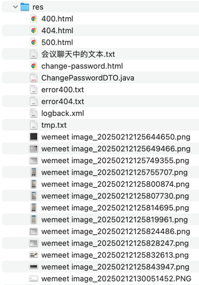

## res


## 会议聊天中的文本

```text
https://gitee.com/saviour113/home/blob/master/src/main/webapp/day_250211/Readme.md

-- -- --

fix: 修复分页功能在无数据时显示异常的问题

-- -- --

exception

-- -- --

GlobalExceptionHandler

-- -- --

private static final Logger logger = LoggerFactory.getLogger(GlobalExceptionHandler.class);

-- -- --

根据日志中的 WARN 优化配置

-- -- --

增加 favicon.ico

-- -- --

避免更新博客的操作误改变作者

-- -- --

private boolean isOwnedByUserOrIsAdmin(Blog blogFromDB) {}

-- -- --

User currentUser = UserUtils.getCurrentUser();
return Objects.equals(blogFromDB.getUser().getId(), currentUser.getId()) || UserUtils.isAdmin();

-- -- --

user-center-navbar

-- -- --

<div th:replace="~{user/_fragment :: #user-center-navbar}"></div>

-- -- --

抽取用户中心左侧导航栏的公共代码

-- -- --

<li class="nav-item">
    <a href="#" th:href="@{/user/change-password}" class="nav-link" th:class="|nav-link ${#strings.startsWith(requestURI, '/user/change-password') ? ' active' : ''}|">
        <i class="bi bi-shield-check"></i>
        修改密码
    </a>
</li>

-- -- --

@GetMapping("change-password")
@PreAuthorize("isAuthenticated()")
String changePassword(Model model) {
    ChangePasswordDTO changePasswordDTO = new ChangePasswordDTO();
    model.addAttribute("changePasswordDTO", changePasswordDTO);
    return "user/change-password";
}

@PostMapping("change-password")
@PreAuthorize("isAuthenticated()")
String changePassword(@Valid @ModelAttribute("changePasswordDTO") ChangePasswordDTO changePasswordDTO,
                     BindingResult result,
                     RedirectAttributes attributes, HttpServletRequest request) throws ServletException {
    User currentUser = UserUtils.getCurrentUser();
    
    // 验证当前密码是否正确
    if (!userService.checkPassword(currentUser, changePasswordDTO.getCurrentPassword())) {
        result.rejectValue("currentPassword", "error-current-password", "当前密码不正确");
    }
    
    // 验证两次新密码是否一致
    if (!changePasswordDTO.getPassword().equals(changePasswordDTO.getConfirmPassword())) {
        result.rejectValue("password", "error-confirm-password", "(新密码)和(确认密码)输入不一致");
    }
    
    if(result.hasErrors()){
        return "user/change-password";
    }
    
    // 更新密码
    assert currentUser != null;
    currentUser.setPassword(changePasswordDTO.getPassword());
    userService.updatePassword(currentUser);
    
    attributes.addFlashAttribute("msg", "密码修改成功！(安全起见，有重要信息变更时，需主动登录)");
    request.logout();
    return "redirect:/login";
}

-- -- --

@Override
public boolean checkPassword(User user, String password) {
    return passwordEncoder.matches(password, user.getPassword());
}
```
