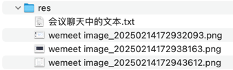

## res


## 会议聊天中的文本

```text
bi-person-circle

-- -- --

<div class="card-body">
    <div th:if="${success}" class="alert alert-success" role="alert" th:text="${success}">
    </div>
    <div th:if="${error}" class="alert alert-danger" role="alert" th:text="${error}">
    </div>
    
    <form th:action="@{/user/change-avatar}" method="post" enctype="multipart/form-data">
        <div class="mb-3">
            <label for="avatar" class="form-label">选择新头像</label>
            <input class="form-control" type="file" id="avatar" name="avatar" accept="image/*" required>
            <div class="form-text">支持 jpg、png 格式，文件大小不超过 10MB</div>
        </div>
        <button type="submit" class="btn btn-primary">上传</button>
    </form>
</div>

-- -- --

@PostMapping("change-avatar")
@PreAuthorize("isAuthenticated()")
String changeAvatar(@RequestParam("avatar") MultipartFile file,
                   RedirectAttributes attributes) {
    try {
        User currentUser = UserUtils.getCurrentUser();
        updateAvatar(file, currentUser);
        userService.update(currentUser);
        attributes.addFlashAttribute("success", "头像更新成功！");
    } catch (Exception e) {
        attributes.addFlashAttribute("error", "头像更新失败：" + e.getMessage());
    }
    return "redirect:/user/change-avatar";
}

@Value("${custom.upload.base-path}")
String uploadBasePath;
@Value("${custom.upload.avatar-path}")
String avatarPath;
private void updateAvatar(MultipartFile file, User user) throws IOException {
    if (file != null && !file.isEmpty()) {
        File dir = new File(uploadBasePath + File.separator + avatarPath);
        if (!dir.exists()) {
            dir.mkdirs();
        }
        String originalFilename = file.getOriginalFilename();
        assert originalFilename != null;
        String suffix = originalFilename.substring(originalFilename.lastIndexOf("."));
        String newFilename = UUID.randomUUID() + suffix;
        file.transferTo(new File(dir.getAbsolutePath() + File.separator + newFilename));
        user.setAvatar("/" + avatarPath + File.separator + newFilename);
    }
}

-- -- --

npm create vue@latest

-- -- --

做完记得发你的gitee仓库地址

-- -- --

允许懵懵懂懂，但是一定要把过程走一遍

-- -- --

如果有某个步骤实在看不懂，可以跳过，但是commit记录要留下来，写上：跳过了哪一个步骤

-- -- --

不追求速度，练习看官方文档。这种动作要逼一逼才会去做
```
