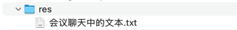

## res


## 会议聊天中的文本

```text
* {
  padding: 0;
  margin: 0;
  box-sizing: border-box;
  text-decoration: none;
  font-family: 'Kanit', sans-serif;
}

body {
  color: #212121;
  background: #f3eeea;
}

button {
  cursor: pointer;
  font-weight: inherit;
  color: inherit;
  font-size: inherit;
  border: none;
  outline: none;
  background: none;
}

-- -- --

.header {
    font-size: 12px;
    background: #0284c7;
    padding: 1rem;
    display: flex;
    justify-content: space-between;
    align-items: center;
    color: #fff;
    font-weight: 300;

    button {
        border-radius: 30px;
    }

    div .del {
        font-size: 20px;
        padding: 3px;
        background: #fff;
        color: #ef4444;
    }

    div .save {
        font-size: 20px;
        padding: 3px;
        background: #fff;
        color: #22c55e;
        margin-left: 10px;
    }
}

h1 {
    padding: 1rem;
}

p {
    padding: 0 1rem 1rem;
    font-weight: 300;
}

-- -- --

form {
    padding: 2rem;
}
h3 {
    margin-bottom: 1rem;
}
div {
    margin-bottom: 1rem;
    label {
        font-weight: 300;
    }
    input,
    textarea {
        max-width: 100%;
        min-width: 100%;
        width: 100%;
        border: 1px solid #333;
        padding: 5px;
        border-radius: 5px;
        &:focus {
            outline: 2px solid #3b82f6;
            border: none;
        }
    }
    button {
        background: #3b82f6;
        color: #fff;
        width: 100%;
        padding: 5px;
        border-radius: 5px;
        &:hover {
            background: #2563eb;
        }
        &:disabled {
            background: #eee;
            cursor: not-allowed
        }
    }
}

-- -- --

<header>
  <nav>
    <RouterLink to="/" class="nav-link">Home</RouterLink>
    <RouterLink to="/post-create" class="nav-link">New Post</RouterLink>
  </nav>
</header>

-- -- --

nav {
  padding: 1rem 2rem;
  background: #1e40af;
  border-bottom: 1px solid #60a5fa;
  .nav-link {
    color: #fff;
    padding: 5px 15px;
    transition: all 0.2s ease-in-out;
    margin-right: 1rem;
    &:hover {
      background: #60a5fa;
    }
  }
}
```
