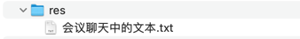

## res


## 会议聊天中的文本

```text
# datasource configuration
spring.datasource.url=jdbc:mysql://localhost:3306/替换成自己的数据库?createDatabaseIfNotExist=true&useSSL=false&serverTimezone=Asia/Shanghai&allowPublicKeyRetrieval=true
spring.datasource.username=root
spring.datasource.password=替换成自己的密码

# JPA configuration
spring.jpa.show-sql=true
spring.jpa.hibernate.ddl-auto=update

-- -- --

@Id
@GeneratedValue(strategy = GenerationType.IDENTITY)
private Long id;

-- -- --

https://gitee.com/i-really-like-quietness/sb-vue-blog
```
