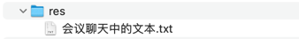

## res


## 会议聊天中的文本

```text
.form-group {
    margin-bottom: 1rem;
  }

  label {
    display: block;
    margin-bottom: 0.5rem;
    font-weight: bold;
  }

  input, textarea {
    width: 100%;
    padding: 0.5rem;
    border: 1px solid #ddd;
    border-radius: 4px;
  }

  textarea {
    height: 150px;
  }

  .buttons {
    display: flex;
    gap: 1rem;
    justify-content: flex-end;
    margin-top: 1rem;
  }

  .buttons button {
    padding: 0.5rem 1rem;
    border-radius: 4px;
    border: none;
    cursor: pointer;

    &.edit {
      background: #0ea5e9;
      color: white;
    }

    &.cancel {
      background: #ef4444;
      color: white;
    }
  }

-- -- --

transform: translate(-50%, -50%);
    background: white;

-- -- --

https://element-plus.org/zh-CN/

-- -- --

npm i axios

-- -- --

// Request interceptor
http.interceptors.request.use(
  config => {
    console.log('请求：', config)
    return config
  },
  error => {
    console.error('请求错误：', error)
    return Promise.reject(error)
  }
)

// Response interceptor
http.interceptors.response.use(
  response => {
    console.log('响应：', response)
    //return response.data
    return response
  },
  error => {
    console.log('响应错误：', error)
    return Promise.reject(error)
  }
)

-- -- --

axios interceptor

-- -- --

// 这种方式会刷新整个页面，如果要更优雅的解决方案，可以使用 Pinia 的状态管理方案，也就是之前用过的 store
```
