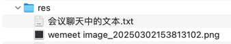

## res


## 会议聊天中的文本

```text
https://www.conventionalcommits.org

-- -- --

fix
feat
chore
docs
refactor
test
...

-- -- --

https://github.com/alibaba/spring-cloud-alibaba

-- -- --

更新以下版本配置：
- Spring Boot 版本从 3.4.3 降级到 3.2.4
- Spring Cloud 版本从 2024.0.0 调整为 2023.0.1
- Java 版本从 17 升级到 21

原因：
为后续要引入的 Spring Boot Alibaba 做准备，使用更稳定、适配的 Spring Boot 和 Spring Cloud 版本

-- -- --

China Railway

-- -- --

当前项目名 cr 取自 china railway 两个单词的首字母

-- -- --

refactor: 修改项目打包类型为 pom，为多模块架构做准备

清理初始化时生成的示例代码，及作为父项目不再需要的文件

原因：
为了更好地组织代码，将项目重构为多模块结构，便于后续功能模块的解耦和维护

-- -- --

feat: 添加用户模块

1. 父项目中添加 modules > module 配置
2. 子模块中添加 parent 配置

-- -- --

https://gitee.com/i-really-like-quietness/cr

-- -- --

feat(user): 创建用户模块启动类

添加 UserApplication 作为用户模块的启动入口：
- 创建标准的 Spring Boot 应用启动类
- 使用 @SpringBootApplication 注解配置
- 放在 com.example.cr.user 包下

这是用户模块的基础架构，为后续开发用户相关功能提供运行环境

-- -- --

chore(user): 添加多环境配置文件

配置 Spring Boot 多环境支持：
1. application.properties（基础配置）
  - 默认服务端口：8080
  - 设置默认激活 dev 环境

2. application-dev.properties（开发环境）
  - 服务端口：8080
  - 在 .gitignore 中忽略它，不需要提交到 git

3. application-prod.properties（生产环境）
  - 服务端口：9090

通过环境配置文件分离，实现开发和生产环境的差异化配置，
提高部署灵活性和安全性

-- -- --

hello user module!

-- -- --

feat(user): 添加 TestController 测试控制器

用于验证：
1. Spring Boot 配置是否正确
2. 模块是否能正常启动和响应请求
3. 基本的 Web 功能是否正常工作

-- -- --

test_shouldReturnExpectedContent

-- -- --

test: 增加 IDEA 集成的 HTTP Request 测试工具

-- -- --

postman
```
