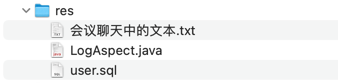

## res


## 会议聊天中的文本

```text
feat: 记录请求和响应日志

添加 LogAspect 类，通过 AOP 记录 HTTP 请求和响应的详细信息，并实现参数脱敏处理

-- -- --

demo
common

-- -- --

<build>
    <plugins>
        <plugin>
            <groupId>org.springframework.boot</groupId>
            <artifactId>spring-boot-maven-plugin</artifactId>
            <configuration>
                <skip>true</skip>
            </configuration>
        </plugin>
    </plugins>
</build>

-- -- --

chore(common): 作为公共模块，不需要被编译成可执行 jar 包

-- -- --

refactor(user|demo|common): 把多个模块都需要的功能代码 LogAspect 移到 common 模块(error)

-- -- --

chore(root|common): 把父模块的依赖剪切到 common 模块中(error)；详见后三个 commit 的补充说明

-- -- --

chore(root|common): 把 test 作用域的 spring-boot-starter-test 依赖从 common 剪切到 user 模块

在 Maven 中，test 作用域的依赖不会【传递】到依赖了它的模块

但是放在根项目中，可以通过 Maven 的继承机制自动被所有子模块【继承】

-- -- --

<!-- 如果 optional=true 即使其他模块依赖了 common 模块，这个依赖也不会被自动传递，有需要的子模块需显式声明 -->

-- -- --

chore(common): optional=true 的依赖不会【自动传递】给其他模块，无论是在根项目还是子模块中

如有需要，子模块需要显式地声明这个依赖才能使用

适用于那些只在某些子模块会使用的依赖，但不希望强制所有模块都依赖于它的场景

-- -- --

chore(user|common): 根据上一个 commit 的说明，把 spring-boot-devtools 依赖从 common 移到明确需要使用它的 user 模块

-- -- --

<dependency>
    <groupId>mysql</groupId>
    <artifactId>mysql-connector-java</artifactId>
    <version>8.0.33</version>
</dependency>

-- -- --

chore(root): 在根项目中通过 dependencyManagement 统一管理依赖版本，此时并不会实际引入依赖

-- -- --

chore(user): 在子模块中引入根模块中 dependencyManagement 定义的 mysql 依赖，此时不需要写版本号了

不写就是用的根模块定义的版本
也可以主动写上版本号，覆盖根模块定义的版本

-- -- --

spring.datasource.url=jdbc:mysql://localhost:3306/数据库名?createDatabaseIfNotExist=true&useSSL=false&serverTimezone=Asia/Shanghai&allowPublicKeyRetrieval=true
spring.datasource.username=root
spring.datasource.password=密码

-- -- --

<dependency>
    <groupId>org.mybatis.spring.boot</groupId>
    <artifactId>mybatis-spring-boot-starter</artifactId>
</dependency>

-- -- --

<dependency>
    <groupId>org.mybatis.spring.boot</groupId>
    <artifactId>mybatis-spring-boot-starter</artifactId>
    <version>3.0.3</version>
</dependency>

-- -- --

mapper

-- -- --

<?xml version="1.0" encoding="UTF-8" ?>
<!DOCTYPE mapper PUBLIC "-//mybatis.org//DTD Mapper 3.0//EN" "http://mybatis.org/dtd/mybatis-3-mapper.dtd" >

<mapper namespace="com.example.cr.user.mapper.UserMapper" >
    <select id="count" resultType="long">
        select count(*) from user
    </select>
</mapper>

-- -- --

mybatis.mapper-locations=classpath:mapper/**/*.xml

-- -- --

feat(user): 引入 MyBatis 之后的基础代码结构和配置

UserMapper 接口
@MapperScan 注解
mybatis.mapper-locations 配置
Controller -> Service -> Mapper
```
