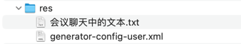

## res


## 会议聊天中的文本

```text
generator

-- -- --

<plugin>
    <groupId>org.mybatis.generator</groupId>
    <artifactId>mybatis-generator-maven-plugin</artifactId>
    <version>1.4.2</version>
    <configuration>
        <configurationFile>src/main/resources/generator-config-user.xml</configurationFile>
        <overwrite>true</overwrite>
        <verbose>true</verbose>
    </configuration>
    <dependencies>
        <dependency>
            <groupId>mysql</groupId>
            <artifactId>mysql-connector-java</artifactId>
            <version>8.0.33</version>
        </dependency>
    </dependencies>
</plugin>

-- -- --

chore(generator): 引入持久层代码生成器插件并增加相关配置文件

-- -- --

feat(user): 用 MyBatis 代码生成器插件自动生成 User 持久层相关代码(error)

-- -- --

fix(user): 在 service 层改用自动生成的计数方法 userMapper.countByExample(...)

-- -- --

// Arrange/Act/Assert 或者 Given/When/Then

-- -- --

test(user): 执行每个单元测试方法之前和之后清理数据库

@BeforeEach、@AfterEach

确保每个测试方法的独立性，避免其他方法执行之后改变了数据库的内容，导致误判

-- -- --

test(user): 单元测试改用独立的数据库

增加 application-test.properties 配置文件
测试类上增加 @ActiveProfiles("test") 注解
在 .gitignore 添加 application-test.properties

确保每个测试方法的独立性，避免其他方法执行之后改变了数据库的内容，导致误判

-- -- --

register

-- -- --

Content-Type: application/x-www-form-urlencoded

-- -- --

register_shouldThrowExceptionWhenMobileAlreadyRegistered

-- -- --

// 正常应该测试返回 RuntimeException，由于默认情况 Spring Boot 的 Controller 层对运行时异常做了二次封装，
// 所以这里测试捕获 ServletException

-- -- --

feat(user): 增加验证“手机号是否注册”的功能以及单元测试代码
```
