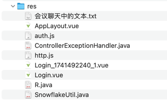

## res


## 会议聊天中的文本

```text
引入 XxxRequest 封装请求数据，就是之前讲过的 DTO

封装从「前端」发送到「后端」的数据

-- -- --

response

-- -- --

R

-- -- --

feat(user): 增加通用的返回结果类 R<T>

response 包下的类用来封装从「后端」返回给「前端」的数据

-- -- --

fix(user): 引入通用返回结果类 R 之后的测试代码修正

-- -- --

advice

-- -- --

UserAlreadyExistsException

-- -- --

CustomException

-- -- --

feat(user): 增加自定义异常，同时更新统一异常处理及测试代码

-- -- --

refactor(user|common): 把公共代码移到 common 模块

-- -- --

<dependency>
            <groupId>org.springframework.boot</groupId>
            <artifactId>spring-boot-starter-validation</artifactId>
        </dependency>

-- -- --

/**
     * 捕捉到 Spring 框架 BindException 校验异常的统一处理
     * @param e 异常
     * @return R 统一返回结果
     */
    @ExceptionHandler(value = BindException.class)
    @ResponseBody
    @ResponseStatus(HttpStatus.UNPROCESSABLE_ENTITY)
    public R<Object> bindExceptionHandler(BindException e) {
        String errorMessage = e.getBindingResult().getFieldErrors().stream()
                .map(error -> error.getField() + ": " + error.getDefaultMessage())
                .collect(Collectors.joining("; "));

        log.error("BindException: {}", errorMessage);
        return R.failValid(errorMessage);
    }

-- -- --

feat(user): Controller 中需要校验的参数统一增加 @RequestBody 注解，接收 json 数据格式

-- -- --

feat(user): 增加校验：手机号必须是11位

-- -- --

@Pattern(regexp = "^1[3-9]\\d{9}$", message = "手机号格式不正确")

-- -- --

feat(user): 增加校验：手机号格式不正确

这条正则表达式规则其实已经包含了之前的 "11位" 规则，为了知道有 @Size 注解，先不删它了

-- -- --

<dependency>
    <groupId>cn.hutool</groupId>
    <artifactId>hutool-all</artifactId>
    <version>5.8.34</version>
</dependency>

-- -- --

feat(common|user): 引入 hutool 依赖，用它的 Snowflake 生成分布式 ID 作为用户 ID

-- -- --

npm create vue@latest

-- -- --

feat(web): 添加前端模块

参考 Vue 官方文档，执行 npm create vue@latest 命令创建项目

-- -- --

feat(web): npm install

cd web
npm install (可以简写成 npm i)
npm run dev

关于 package-lock.json 文件的补充说明：

这个文件也可以不提交到版本控制
它的作用是记录当前依赖的具体版本号
package.json 写的依赖版本号可以某个区分范围的写法，比如 ^2.3.0 代表 "Compatible with version" 兼容这个版本的意思，根据“语义化版本”版本的规范，类似于 >=2.3.0 <3.0.0，如果当前目录下没有 lock 文件，一个月之后你拿到代码，执行 npm install，实际安装的版本可能是 2.3.8 等等了，有 lock 文件，就用 lock 文件当时记录下来的指定版本号

更多细节参考官方文档：
1. https://docs.npmjs.com/cli/configuring-npm/package-json#dependencies
2. https://semver.org

-- -- --

refactor(web): 精简自动生成的前端代码

-- -- --

https://element-plus.org/zh-CN/guide/installation.html

-- -- --

npm install element-plus --save

-- -- --

feat(web): 安装 element-plus 开源 Vue 组件

cd web
npm install element-plus --save

https://element-plus.org/zh-CN/guide/installation.html

-- -- --

feat(web): 引入 Element Plus，并测试使用最基础的按钮组件

https://element-plus.org/zh-CN/guide/quickstart.html

-- -- --

feat(web): 增加一个新页面 Login.vue

-- -- --

feat(web): 登录页面增加最基础的手机号和验证码登录功能轮廓

-- -- --

refactor(web): 优化验证码输入框和获取验证码按钮的显示效果

-- -- --

// td-1：保存到验证码历史记录表
        // 建议的表字段 (id, code, mobile, 有效期, 已使用?, 业务类型[登录/忘记密码...], 生成时间, 使用时间)
        // 暂时通过打印日志模拟
        log.info("【模拟】已经保存到验证码历史记录表。验证码：{}，手机号：{}", code, mobile);

        // td-2：对接真实的短信发送服务
        log.info("【模拟】短信发送成功。验证码：{}，手机号：{}", code, mobile);

-- -- --

feat(user): 增加发送短信验证码接口

-- -- --

refactor(user): 为了方便测试，暂时生成固定的验证码

-- -- --

UserNotExistsException

-- -- --

CommonBusinessException

-- -- --

/*
    暂时先直接返回 User，实际中不应该把用户所有的信息全部返回出去，因为：
    1. 会涉及隐私的问题，比如密码字段
    2. 会涉及到很多不必要的字段，比如数据库中的创建时间、更新时间、额外标记字段等等
    3. 还会涉及到有些字段并不是 User 这个实体的字段，比如 token 等
     */

-- -- --

feat(user): 增加用户登录接口

-- -- --

feat(user): 用户登录接口的方法返回值从 User 改成 LoginResponse

-- -- --

refactor(user): BeanUtil.copyProperties(源Bean对象, 目标Class)

-- -- --

refactor(user): DRY

-- -- --

npm i axios

-- -- --

ElMessage.error(error.response?.data?.msg || '发送验证码失败')

-- -- --

feat(web): 前端页面对接后端的发送验证码接口 (跨域错误)

安装 axios 依赖
 - cd web
 - npm i axios
封装网络请求的基础代码结构

-- -- --

@CrossOrigin("http://localhost:5173")

-- -- --

fix(user): 解决跨域问题 @CrossOrigin

-- -- --

test(web): 为了方便本地测试，登录页面的手机号输入框设置默认值

-- -- --

feat(web): 前端页面对接后端的登录接口

-- -- --

refactor(web): App.vue 去除头部的导航栏，只保留最简洁的 <RouterView />

-- -- --

feat(web): 验证码没输入或者长度小于4时，登录按钮不可被点击

-- -- --

feat(web): 登录按钮增加 loading 效果

- 点击登录时禁用按钮且显示正在加载的状态
- 在 finally 语句块中恢复状态

-- -- --

layout

-- -- --

Dashboard

-- -- --

Empty

-- -- --

{
      path: '/',
      component: AppLayout,
      redirect: '/dashboard',
      children: [
        {
          path: 'dashboard',
          name: 'Dashboard',
          component: () => import('../views/Dashboard.vue'),
          meta: { title: '仪表盘' }
        },
        {
          path: 'empty',
          name: 'Empty',
          component: () => import('../views/Empty.vue'),
          meta: { title: '空白页面' }
        }
      ]
    },

-- -- --

npm install @element-plus/icons-vue

-- -- --

feat(web): 增加用户登录成功之后的页面基础代码

- 删除不再需要的 HomeView 和 AboutView
- 增加 Dashboard、Empty 页面轮廓
- npm install @element-plus/icons-vue

-- -- --

feat(web): 登录成功之后跳转到 /dashboard

-- -- --

feat(web): 增加回车键登录的便捷功能
```
