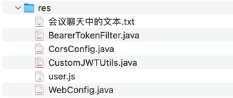

## res


## 会议聊天中的文本

```text
replace-with-your-own-key

-- -- --

feat(common): 增加工具类 CustomJWTUtils

-- -- --

feat(user): 登录成功之后生成 JWT token

-- -- --

feat(web): 在前端通过 Pinia store 管理登录成功之后的用户信息

-- -- --

feat(web): 从 Pinia store 中读取用户信息

-- -- --

feat(web): Pinia store 结合 localStorage 保存或清理登录用户信息

1. 从 localStorage 读取数据
2. 在 setUserInfo 时同时将数据保存到 localStorage
3. 在 clearUserInfo 时同时清除 localStorage 中的数据

现在即使刷新页面，用户信息也不会丢失，直到用户主动登出或清除浏览器数据

-- -- --

meta: {
        title: '登录',
        requiresAuth: false  // 登录页不需要验证
      }

-- -- --

// 全局前置守卫
router.beforeEach((to, from, next) => {
  const userStore = useUserStore()

  // 如果页面需要认证（默认都需要认证，除非明确标记不需要）
  if (to.meta.requiresAuth !== false) {
    // 检查是否有 token
    if (!userStore.token) {
      // 如果没有 token，重定向到登录页
      next({
        path: '/login',
        query: { redirect: to.fullPath }
      })
      return
    }
  }

  // 如果已登录且要访问登录页，重定向到首页
  if (to.path === '/login' && userStore.token) {
    next({ path: '/dashboard' })
    return
  }

  next()
})

-- -- --

feat(web): 添加全局路由守卫

- 如果页面需要认证且没有 token，重定向到登录页
- 如果已登录还访问登录页，重定向到首页
- 其他情况正常通过

-- -- --

config.headers.Authorization = `Bearer ${userStore.token}`

-- -- --

feat(web): 如果从后端成功拿到了 token，后续所有请求都自动把它添加到请求头

-- -- --

feat(web): 真实请求后端的测试接口并把返回值显示在 Dashboard 页面中 ping/pong 同时检查请求头是否带了 token

-- -- --

feat(user): 增加 BearerTokenFilter 解析并校验 token

-- -- --

import router from '@/router'

-- -- --

// 如果后端返回 401 未授权错误（未登录或 token 失效）
    if (error.response?.status === 401) {
      const userStore = useUserStore()
      // 清除用户信息
      userStore.clearUserInfo()
      // 跳转到登录页，并带上原本要去的路径
      router.push({
        path: '/login',
        query: {
          redirect: router.currentRoute.value.fullPath
        }
      })
    }

-- -- --

fix(user): 解决增加了 BearerTokenFilter 之后的跨域问题，改用全局 CORS 配置

-- -- --

feat(web): 如果后端返回 401 (未登录或 token 失效)，清除前端保存的用户信息并跳转到登录页
```
