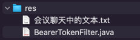
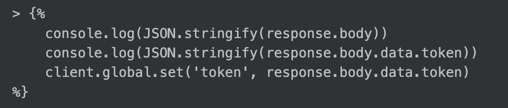

## res


## 会议聊天中的文本



```text
-- -- --

test(user): IDEA 集成的 HTTP Request 测试工具设置全局变量 token

-- -- --

test(user): 增加 BearerTokenFilter 之后修改相应的单元测试代码

-- -- --

https://iae666b.github.io/iae-study-journal/

-- -- --

gateway

-- -- --

<dependency>
    <groupId>org.springframework.cloud</groupId>
    <artifactId>spring-cloud-starter-gateway</artifactId>
</dependency>

-- -- --

<dependency>
    <groupId>org.springframework.cloud</groupId>
    <artifactId>spring-cloud-dependencies</artifactId>
    <version>${spring-cloud.version}</version>
    <type>pom</type>
    <scope>import</scope>
</dependency>

-- -- --

<spring-cloud.version>2023.0.1</spring-cloud.version>

-- -- --

spring:
  cloud:
    gateway:
      routes:
        - id: user
          predicates:
            - Path=/u/**
          filters:
            - StripPrefix=1
          uri: http://127.0.0.1:8081

-- -- --

<exclusion>
    <groupId>org.springframework.boot</groupId>
    <artifactId>spring-boot-starter-web</artifactId>
</exclusion>
<exclusion>
    <groupId>org.springframework.boot</groupId>
    <artifactId>spring-boot-starter-aop</artifactId>
</exclusion>
<exclusion>
    <groupId>org.springframework.boot</groupId>
    <artifactId>spring-boot-starter-validation</artifactId>
</exclusion>
<exclusion>
    <groupId>org.projectlombok</groupId>
    <artifactId>lombok</artifactId>
</exclusion>

-- -- --

chore(gateway): 网关模块增加第一个路由转发，将 /u/** 的请求转发到 user 模块

-- -- --

  globalcors:
    corsConfigurations:
      '[/**]':
        allowedOrigins: "http://localhost:5173"
        allowedMethods:
          - GET
          - POST
          - PUT
          - DELETE
          - OPTIONS
        allowedHeaders: "*"
        allowCredentials: true
        maxAge: 3600

-- -- --

refactor(gateway|user): 统一在网关做跨域配置

-- -- --

refactor(gateway|user): 统一在网关增加 Filter 代替之前 user 模块的 BearerTokenFilter

-- -- --

const MODULE_PREFIX = '/u'

-- -- --

refactor(web): 在前端请求后端地址统一改成网关的地址；注意端口号 8000，前缀 /u

-- -- --

fix(gateway): 复习之前的 @Import 注解，精准注入 BearerTokenFilter 需要用到的 CustomJWTUtils

-- -- --

HW：
1、基于当前的代码状态（拉出一个新分支或复制成一个新项目）把之前做好的 vue-blog 整合进来
2、基于当前的项目复制一份，以当前代码状态为基点，做一个自己的个人项目
3、之前的小组的项目，这周天结束，这周天不用来教室，约着去哪里都可以，周日的下一次课的时候就是最后一次汇报  (优先级最高) 下周一晚上进行汇报
```