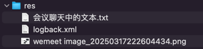

## res


## 会议聊天中的文本

```text
未来产品上市新闻稿

-- -- --

昕豪组
前端：
https://gitee.com/zxhhhxz1221/resource_station_frontend
后端：
https://gitee.com/zxhhhxz1221/resource_station_backend

-- -- --

志壕组
前端：
https://gitee.com/shang_4_0/vue-we-learn
后端：
https://gitee.com/shang_4_0/sb-vue-we-learn

-- -- --

https://excalidraw.com/

-- -- --

chore: 在根模块统一管理所有依赖的版本

-- -- --

refactor: 不再使用 lombok

-- -- --

chore(user): 添加 logback 日志配置

-- -- --

feat(web-admin): 从 xxxx 版本的 web 代码复制而来

-- -- --

fix(web-admin): 修改 web-admin 项目名

-- -- --

chore(web-admin): 相关页面标题增加 “Admin” 标识

-- -- --

server: {
    port: 6173
}

-- -- --

chore(web-admin): vite.config.js 配置指定服务端口 6173

-- -- --

chore(gateway): cors 增加允许 6173 端口

-- -- --

, HttpServletRequest servletRequest

-- -- --

boolean isAdminLogin = servletRequest.getRequestURI().endsWith("admin-login");


-- -- --

feat(gateway|user|admin-web): web-admin 登录时调用 admin-login 接口

同时，只有特定用户才能访问后台管理页面

-- -- --

https://github.com/zxh111222/cr
```