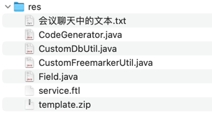

## res


## 会议聊天中的文本

```text
https://excalidraw.com/

-- -- --

show full columns from `user`

-- -- --

CustomDbUtil

-- -- --

// --- <数据库配置信息> ---
Node connectionRUL = document.selectSingleNode("//@connectionURL");
Node userId = document.selectSingleNode("//@userId");
Node password = document.selectSingleNode("//@password");
CustomDbUtil.url = connectionRUL.getText();
CustomDbUtil.user = userId.getText();
CustomDbUtil.password = password.getText();
// --- </数据库配置信息> ---

-- -- --

getColumnByTableName

-- -- --

从之前的业务代码中抽取出通用模版 + 数据 = 无限可能

-- -- --

/**
 * 下划线转小驼峰。例：user_id 转成 userId
 */
public static String underLineToLowerCameCase(String str) {
    Pattern linePattern = Pattern.compile("_(\\w)");
    str = str.toLowerCase();
    Matcher matcher = linePattern.matcher(str);
    StringBuffer sb = new StringBuffer();
    while (matcher.find()) {
        matcher.appendReplacement(sb, matcher.group(1).toUpperCase());
    }
    matcher.appendTail(sb);
    return sb.toString();
}

-- -- --

/**
 * 下划线转大驼峰：user_id 转成 UserId
 */
public static String underLineToUpperCameCase(String str) {
    String s = underLineToLowerCameCase(str);
    return s.substring(0, 1).toUpperCase() + s.substring(1);
}

-- -- --

String nameLowerCamelCase; // 字段名小驼峰：xxxId
String nameUpperCamelCase; // 字段名大驼峰：XxxId

-- -- --

/**
 * 数据库类型转为 Java 类型
 */
public static String sqlTypeToJavaType(String sqlType) {
    if (sqlType.toUpperCase().contains("varchar".toUpperCase())
            || sqlType.toUpperCase().contains("char".toUpperCase())
            || sqlType.toUpperCase().contains("text".toUpperCase())) {
        return "String";
    } else if (sqlType.toUpperCase().contains("datetime".toUpperCase())) {
        return "Date";
    } else if (sqlType.toUpperCase().contains("time".toUpperCase())) {
        return "Date";
    } else if (sqlType.toUpperCase().contains("date".toUpperCase())) {
        return "Date";
    } else if (sqlType.toUpperCase().contains("bigint".toUpperCase())) {
        return "Long";
    } else if (sqlType.toUpperCase().contains("int".toUpperCase())) {
        return "Integer";
    } else if (sqlType.toUpperCase().contains("long".toUpperCase())) {
        return "Long";
    } else if (sqlType.toUpperCase().contains("decimal".toUpperCase())) {
        return "BigDecimal";
    } else if (sqlType.toUpperCase().contains("boolean".toUpperCase())) {
        return "Boolean";
    } else {
        return "String";
    }
}

-- -- --

// 假设当前项目的表名有统一前缀 xxx_ 则后续需要的各种变量尽量以实体名做为基础进行修改
// 大驼峰格式的 Domain 变量 (配置文件中配置的实体名，如 OneTwo)
String Domain = domainObjectName;
// 小驼峰格式的 domain = (配置文件中配置的实体名，首字母改成小些，如 oneTwo)
String domain = Domain.substring(0, 1).toLowerCase() + Domain.substring(1);

-- -- --

<pagehelper.version>1.4.6</pagehelper.version>

-- -- --

<dependency>
    <groupId>com.github.pagehelper</groupId>
    <artifactId>pagehelper-spring-boot-starter</artifactId>
    <version>${pagehelper.version}</version>
</dependency>

-- -- --

<dependency>
    <groupId>com.github.pagehelper</groupId>
    <artifactId>pagehelper-spring-boot-starter</artifactId>
    <exclusions>
        <exclusion>
            <groupId>org.mybatis.spring.boot</groupId>
            <artifactId>mybatis-spring-boot-starter</artifactId>
        </exclusion>
    </exclusions>
</dependency>

-- -- --

feat(root|common): common 模块增加分页相关的通用代码和分页依赖

-- -- --

feat(generator): 增加自动【前/C/S】的 template 和 data

-- -- --

-- sb
drop table if exists `sb`;
create table `sb`
(
    `id`         bigint primary key,
    `name`       varchar(20) null COMMENT '傻逼用户名',
    `email`      varchar(50) null COMMENT '傻逼邮箱',
    `password`   varchar(50) null COMMENT '傻逼密码',
    `mobile`     varchar(11) not null comment '傻逼手机号',
    `created_at` datetime(3) null comment '傻逼创建时间', -- 精度为 3 位小数秒，表示可以存储到毫秒级别。
    `updated_at` datetime(3) null comment '傻逼更新时间', -- 例如，2025-01-01 12:34:56.789
    unique key `mobile_unique` (`mobile`)
) comment ='傻逼';

-- -- --

feat(generator): 自动生成 sb 持久层代码

-- -- --

自动生成 sb 前端/C/S层代码

-- -- --

|searchable

-- -- --

course

-- -- --

description

-- -- --

增加【课程】建表语句

-- -- --

chore(user): 增加自动生成【课程】代码必须的配置信息

-- -- --

feat(user): 自动生成【课程】持久层代码

-- -- --

feat(user): 自动生成【课程】前端/C/S层代码

-- -- --

feat(user): 手动增加【课程】相关路由和菜单

-- -- --

DataLine

-- -- --

feat(user): 手动修改【课程】菜单图标
```