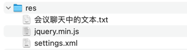

## res


## 会议聊天中的文本

```text
chat-container

-- -- --

chat-history

-- -- --

input-container

-- -- --

message-input

-- -- --

send-button

-- -- --

.chat-container {
    height: 100vh;
    display: flex;
    flex-direction: column;
    justify-content: space-between;
}
.chat-history {
    border: 1px solid darkred;
    height: 800px;
}
.input-container {
    border: 1px solid darkgreen;
}

-- -- --

function addMessage(content) {
    const messageDiv = document.createElement('div');
    messageDiv.className = `message`;

    const messageContent = document.createElement('div');
    messageContent.className = 'message-content';
    messageContent.textContent = content;

    messageDiv.appendChild(messageContent);
    chatHistory.appendChild(messageDiv);
}

-- -- --

.message {
    margin-bottom: 15px;
    display: flex;
}
.message-content {
    padding: 10px 15px;
    border-radius: 15px;
    max-width: 70%;
}

-- -- --

messageDiv.className = `message ${isAI ? 'ai-message' : 'user-message'}`;

-- -- --

.user-message {
    justify-content: flex-end;
}

.ai-message {
    justify-content: flex-start;
}

-- -- --

// 滚动到最新消息
chatHistory.scrollTop = chatHistory.scrollHeight;

-- -- --

历史消息显示区域增加自动滚动到最新消息的效果

-- -- --

function getResponseFromServer(message) {
    $.get("/ai/chat", {message: message}, function(resp) {
        addMessage(resp, true)
    });
}

-- -- --

<repositories>
    <repository>
        <id>spring-milestones</id>
        <name>Spring Milestones</name>
        <url>https://repo.spring.io/milestone</url>
        <snapshots>
            <enabled>false</enabled>
        </snapshots>
    </repository>
</repositories>

-- -- --

<dependency>
    <groupId>com.alibaba.cloud.ai</groupId>
    <artifactId>spring-ai-alibaba-starter</artifactId>
    <version>1.0.0-M2.1</version>
</dependency>

-- -- --

private final ChatClient chatClient;

public AIController(ChatClient.Builder builder) {
    this.chatClient = builder.build();
}

@GetMapping("chat")
public String chat(String message) {
    return this.chatClient.prompt()
            .user(message)
            .call()
            .content();
}

-- -- --

@GetMapping(value = "/chat-stream", produces = MediaType.TEXT_EVENT_STREAM_VALUE + ";charset=UTF-8")
    public Flux<String> stream(String prompt){
        return this.chatClient.prompt()
                .user(prompt)
                .stream()
                .content();
    }

-- -- --

function getStreamResponse(message) {
    // 创建AI消息占位符
    const aiMessageContent = addMessage('', true);
    
    // 创建EventSource连接
    const eventSource = new EventSource(`/ai/chat-stream?prompt=${encodeURIComponent(message)}`);
    
    // 用于累积接收到的内容
    let accumulatedContent = '';
    
    // 处理接收到的消息
    eventSource.onmessage = function(event) {
        accumulatedContent += event.data;
        aiMessageContent.textContent = accumulatedContent;
        chatHistory.scrollTop = chatHistory.scrollHeight;
    };
    
    // 处理错误
    eventSource.onerror = function(error) {
        eventSource.close();
        if (accumulatedContent === '') {
            aiMessageContent.textContent = '抱歉，发生错误了';
        }
    };
}

-- -- --

return messageContent; // 返回消息内容元素，用于流式更新
```