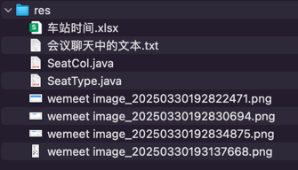

## res


## 会议聊天中的文本

```text
drop table if exists `train_station`;
create table `train_station`
(
    `id`          bigint        not null comment 'id',
    `train_code`  varchar(20)   not null comment '车次编号',
    `index`       int           not null comment '站序',
    `name`        varchar(20)   not null comment '站名',
    `name_pinyin` varchar(50)   not null comment '站名拼音',
    `in_time`     time comment '进站时间',
    `out_time`    time comment '出站时间',
    `stop_time`   time comment '停站时长',
    `km`          decimal(8, 2) not null comment '里程（公里）|从上一站到本站的距离',
    `created_at`  datetime(3) null comment '创建时间',
    `updated_at`  datetime(3) null comment '更新时间',
    primary key (`id`),
    unique key `train_code_index_unique` (`train_code`, `index`),
    unique key `train_code_name_unique` (`train_code`, `name`)
) comment ='火车车站';

-- -- --

drop table if exists `train_carriage`;
create table `train_carriage`
(
    `id`           bigint      not null comment 'id',
    `train_code`   varchar(20) not null comment '车次编号|searchable',
    `index`        int         not null comment '厢号',
    `seat_type`    char(1)     not null comment '座位类型|枚举[SeatType]',
    `seat_count`   int         not null comment '座位数',
    `row_count`    int         not null comment '排数',
    `col_count` int         not null comment '列数',
    `created_at` datetime(3) null comment '创建时间',
    `updated_at` datetime(3) null comment '更新时间',
    unique key `train_code_index_unique` (`train_code`, `index`),
    primary key (`id`)
) comment ='火车车厢';

-- -- --

自动生成 SeatType 枚举类对应的前端 js 数组

-- -- --

drop table if exists `train_seat`;
create table `train_seat`
(
    `id`                  bigint      not null comment 'id',
    `train_code`          varchar(20) not null comment '车次编号|searchable',
    `carriage_index`      int         not null comment '厢序',
    `row`                 char(2)     not null comment '排号|01, 02',
    `col`                 char(1)     not null comment '列号|枚举[SeatCol]',
    `seat_type`           char(1)     not null comment '座位类型|枚举[SeatType]',
    `carriage_seat_index` int         not null comment '同车厢座序',
    `created_at` datetime(3) null comment '创建时间',
    `updated_at` datetime(3) null comment '更新时间',
    primary key (`id`)
) comment ='车厢座位';

-- -- --

LocationInformation

Van

Guide

Box

Ticket

-- -- --

-- 每日车次
drop table if exists `daily_train`;
create table `daily_train`
(
    `id`           bigint      not null comment 'id',
    `date`         date        not null comment '日期',
    `code`         varchar(20) not null comment '车次编号|searchable',
    `type`         char(1)     not null comment '车次类型|枚举[TrainType]',
    `start`        varchar(20) not null comment '始发站',
    `start_pinyin` varchar(50) not null comment '始发站拼音',
    `start_time`   time        not null comment '出发时间',
    `end`          varchar(20) not null comment '终点站',
    `end_pinyin`   varchar(50) not null comment '终点站拼音',
    `end_time`     time        not null comment '到站时间',
    `created_at` datetime(3) null comment '创建时间',
    `updated_at` datetime(3) null comment '更新时间',
    primary key (`id`),
    unique key `date_code_unique` (`date`, `code`)
) comment='每日车次';

-- -- --

Calendar

-- -- --

pinyin-pro

-- -- --

handleNameChange

-- -- --

// 监听站名变化，自动填充拼音

-- -- --

pattern: 'first'

-- -- --

输入“站名”时自动生成“站名拼音”和“站名拼音首字母”

-- -- --

-- 每日火车车站
drop table if exists `daily_train_station`;
create table `daily_train_station`
(
    `id`          bigint        not null comment 'id',
    `date`        date          not null comment '日期',
    `train_code`  varchar(20)   not null comment '车次编号|searchable',
    `index`       int           not null comment '站序|约定第一站是0',
    `name`        varchar(20)   not null comment '站名',
    `name_pinyin` varchar(50)   not null comment '站名拼音',
    `in_time`     time comment '进站时间',
    `out_time`    time comment '出站时间',
    `stop_time`   time comment '停站时长',
    `km`          decimal(8, 2) not null comment '里程（公里）|从上一站到本站的距离',
    `created_at` datetime(3) null comment '创建时间',
    `updated_at` datetime(3) null comment '更新时间',
    primary key (`id`),
    unique key `date_train_code_index_unique` (`date`, `train_code`, `index`),
    unique key `date_train_code_name_unique` (`date`, `train_code`, `name`)
) comment ='每日火车车站';

-- -- --

-- 每日火车车厢
drop table if exists `daily_train_carriage`;
create table `daily_train_carriage`
(
    `id`          bigint      not null comment 'id',
    `date`        date        not null comment '日期',
    `train_code`  varchar(20) not null comment '车次编号|searchable',
    `index`       int         not null comment '厢号',
    `seat_type`   char(1)     not null comment '座位类型|枚举[SeatType]',
    `seat_count`  int         not null comment '座位数',
    `row_count`   int         not null comment '排数',
    `col_count`   int         not null comment '列数',
    `created_at` datetime(3) null comment '创建时间',
    `updated_at` datetime(3) null comment '更新时间',
    unique key `date_train_code_index_unique` (`date`, `train_code`, `index`),
    primary key (`id`)
) comment ='每日火车车厢';

-- -- --

-- 每日座位
drop table if exists `daily_train_seat`;
create table `daily_train_seat`
(
    `id`                  bigint      not null comment 'id',
    `date`                date        not null comment '日期',
    `train_code`          varchar(20) not null comment '车次编号|searchable',
    `carriage_index`      int         not null comment '厢序',
    `row`                 char(2)     not null comment '排号|01, 02',
    `col`                 char(1)     not null comment '列号|枚举[SeatCol]',
    `seat_type`           char(1)     not null comment '座位类型|枚举[SeatType]',
    `carriage_seat_index` int         not null comment '同车厢座序',
    `sell`                varchar(50) not null comment '售卖情况|将经过的车站用01拼接，0表示可卖，1表示已卖',
    `created_at` datetime(3) null comment '创建时间',
    `updated_at` datetime(3) null comment '更新时间',
    primary key (`id`)
) comment ='每日座位';

-- -- --

作业一：自己画出 Excel 那张图
以福厦高铁为例子：计算总票数
找一个真实例子，比如：有人买了福州到厦门北的车票，余票怎么变化

-- -- --

作业二：完成每日数据另外三张表的CRUD

-- -- --

作业三：用这套自己写的代码生成器，做一个自己想做的系统
```