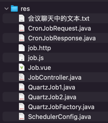

## res


## 会议聊天中的文本

```text
scheduler

-- -- --

任务调度

-- -- --

快速演示 Spring 自带的定时任务功能

-- -- --

private static final Logger log = LoggerFactory.getLogger(SpringJobDemo.class);


-- -- --

// Spring 自带的定时任务简单易用，但是它有一些缺点；适合单体小项目，快速实现定时任务
// 这个项目是分布式应用，我们会使用 Quartz，适合分布式等更大型的项目

-- -- --

注释 Spring 自带的定时任务功能

-- -- --

<dependency>
    <groupId>org.springframework.boot</groupId>
    <artifactId>spring-boot-starter-quartz</artifactId>
</dependency>

-- -- --

QuartzConfig

-- -- --

QuartzJobDemo

-- -- --

/**
 * 任务
 * @return JobDetail
 */
@Bean
public JobDetail jobDetail() {
    return JobBuilder.newJob().ofType(QuartzJobDemo.class)
            .withIdentity("QuartzJobDemo", "g_job")
            .withDescription("QuartzJobDemo_Description")
            .storeDurably()
            .build();
}

/**
 * 触发器
 */
@Bean
public Trigger trigger() {
    return TriggerBuilder.newTrigger().forJob(jobDetail())
            .withIdentity("QuartzJobDemo_Trigger", "g_trigger")
            .withDescription("QuartzJobDemo_Trigger_Description")
            .startNow()
            //.withSchedule(simpleSchedule().repeatForever().withIntervalInHours(1))
            .withSchedule(CronScheduleBuilder.cronSchedule("0/5 * * * * ?"))
            .build();
}

-- -- --

引入 Quartz 依赖并快速演示 Quartz 定时任务功能

-- -- --

Quartz 整合 MySQL 数据库 spring.quartz.job-store-type=jdbc

-- -- --

后端增加操作 Quartz 的接口及 job.http

-- -- --

Timer
```