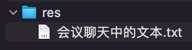

## res


## 会议聊天中的文本

```text
DailyTrainJob

-- -- --

生成【每日车次】数据 - 开始
生成【每日车次】数据 - 结束

-- -- --

新增 DailyTrainJob 生成【每日车次】数据 - 基础

-- -- --

演示 Quartz 定时任务默认的并发执行效果

- 当前触发器配置的是每 5 秒执行一次
- 任务本身通过需要至少 8 秒时间，通过 Thread.sleep(8000) 模拟

效果：不管上一个周期的任务是否执行完成，都准时执行下一个周期

即：默认并发执行定时任务

-- -- --

演示禁用 Quartz 定时任务默认的并发执行效果 @DisallowConcurrentExecution

-- -- --

genDaily

-- -- --

genDailyTrain

-- -- --

@DateTimeFormat(pattern = "yyyy-MM-dd")
```