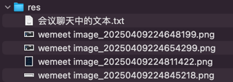

## res


## 会议聊天中的文本

```text
<dependency>
    <groupId>org.springframework.cloud</groupId>
    <artifactId>spring-cloud-starter-openfeign</artifactId>
</dependency>

-- -- --

chore(scheduler): 引入 openfeign 相关依赖

-- -- --

feign

-- -- --

feat(scheduler): 演示如何通过 openfeign 实现服务间调用

-- -- --

类比之前学过的 JPA 思路

-- -- --

feat(scheduler): DailyTrainJob 跨服务调用 business 模块新增加的 gen-daily/{date} 接口

-- -- --

log.debug("生成日期【{}】车次【{}】的【每日火车车站】数据 - 开始", DateUtil.formatDate(date), trainCode);


-- -- --

log.debug("先删除日期【{}】车次【{}】的已有【每日火车车站】数据", DateUtil.formatDate(date), trainCode);


-- -- --

log.debug("生成日期【{}】车次【{}】的【每日火车车站】数据 - 完成", DateUtil.formatDate(date), trainCode);


-- -- --

feat(business): 增加生成指定日期和车次的【每日火车车站】

-- -- --

作业一：自动生成【每日火车车厢】和【每日座位】

-- -- --

作业二：后端增加自动生成座位的接口 gen-seat/{trainCode}
```