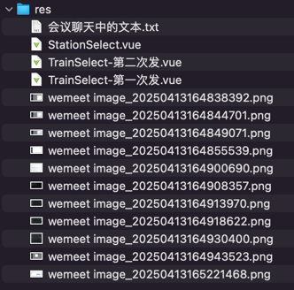

## res


## 会议聊天中的文本

```text
<el-select
    v-model="trainStationForm.trainCode"
    filterable
    remote
    reserve-keyword
    placeholder="不知道车次？可以输入起始站或终点站搜索车次"
    :remote-method="handleTrainCodeSearch"
    :loading="trainCodeLoading"
    style="width: 100%"
  >
    <el-option
      v-for="item in trainCodeOptions"
      :key="item.value"
      :label="item.label"
      :value="item.value"
    >
      <span style="float: left">{{ item.value }}</span>
      <span style="float: right; color: #8492a6; font-size: 13px">
        {{ item.start }} -> {{ item.end }}
      </span>
    </el-option>
  </el-select>

-- -- --

// 添加车次选择相关的数据
const trainCodeOptions = ref([])
const trainCodeLoading = ref(false)

// 远程搜索车次的方法
const handleTrainCodeSearch = async (query) => {
  if (!query) {
    trainCodeOptions.value = []
    return
  }

  trainCodeLoading.value = true
  try {
    const res = await listTrain({
      page: 1,
      size: 20,
      keyword: query // 使用关键字搜索
    })
    if (res.code === 200) {
      trainCodeOptions.value = res.data.list.map(item => ({
        value: item.code,
        label: `${item.code} (${item.start} -> ${item.end})`,
        start: item.start,
        end: item.end
      }))
    }
  } catch (error) {
    console.error('获取车次列表失败:', error)
  } finally {
    trainCodeLoading.value = false
  }
}

-- -- --

feat(web-admin): 火车车站管理页面的车次编号输入框改成支持搜索的下拉框

-- -- --

import TrainSelect from "@/components/TrainSelect.vue";

-- -- --

feat(web-admin): 抽取出车次编号下拉框组件 TrainSelect.vue

-- -- --

feat(web-admin): 新增火车车厢的车次编号输入框也改用 TrainSelect 组件

-- -- --

feat(web-admin): 新增车厢座位的车次编号输入框也改用 TrainSelect 组件

-- -- --

feat(web-admin): TrainSelect 车次编号下拉框组件支持分页功能

主要改进：
- 添加分页相关数据管理
- 记录当前搜索关键字，用于加载更多时继续使用
- 搜索时重置页码
- 第一页替换现有数据，后续页面追加数据
- 底部显示"加载更多"按钮，只在有更多数据时显示
- 添加了阻止事件冒泡，防止点击按钮时关闭下拉框
- 使用计算属性判断是否还有更多数据
- 加载状态显示在按钮上

这样用户可以：
- 输入关键字搜索车次
- 看到第一页的搜索结果
- 如果有更多结果，可以点击"加载更多"按钮
- 新的结果会追加到现有列表中
- 直到加载完所有匹配的车次

-- -- --

<StationSelect 
  v-model="trainForm.start"
  />

-- -- --

@update:modelValue="handleStartChange"

-- -- --

// 监听始发站变化，自动填充拼音
const handleStartChange = (value) => {
  if (!value) {
    trainForm.startPinyin = ''
    return
  }
  trainForm.startPinyin = pinyin(value, { toneType: 'none', type: 'string' }).replace(/\s/g, '')
}

-- -- --

// 监听终点站变化，自动填充拼音
const handleEndChange = (value) => {
  if (!value) {
    trainForm.endPinyin = ''
    return
  }
  trainForm.endPinyin = pinyin(value, { toneType: 'none', type: 'string' }).replace(/\s/g, '')
}

-- -- --

// 计算停站时长
const calculateStopTime = () => {
  if (trainStationForm.inTime && trainStationForm.outTime) {
    // 解析时间部分
    const [inHour, inMin, inSec] = trainStationForm.inTime.split(':').map(Number)
    const [outHour, outMin, outSec] = trainStationForm.outTime.split(':').map(Number)

    // 转换为秒数进行计算
    const inSeconds = inHour * 3600 + inMin * 60 + inSec
    const outSeconds = outHour * 3600 + outMin * 60 + outSec
    const diffSeconds = outSeconds - inSeconds

    if (diffSeconds < 0) {
      ElMessage.warning('出站时间不能早于进站时间')
      trainStationForm.outTime = ''
      trainStationForm.stopTime = ''
      return
    }

    // 转换为 HH:mm:ss 格式
    const hours = Math.floor(diffSeconds / 3600)
    const minutes = Math.floor((diffSeconds % 3600) / 60)
    const seconds = diffSeconds % 60
    trainStationForm.stopTime = `${hours.toString().padStart(2, '0')}:${minutes.toString().padStart(2, '0')}:${seconds.toString().padStart(2, '0')}`
  } else {
    trainStationForm.stopTime = ''
  }
}

-- -- --

@change="calculateStopTime"

-- -- --

feat(web-admin): 新增火车车站时，根据[进站时间]和[出站时间]自动计算[停站时长]

-- -- --

-- 余票信息
drop table if exists `daily_train_ticket`;
create table `daily_train_ticket`
(
    `id`           bigint        not null comment 'id',
    `date`         date          not null comment '日期',
    `train_code`   varchar(20)   not null comment '车次编号|searchable',
    `start`        varchar(20)   not null comment '出发站|searchable',
    `start_pinyin` varchar(50)   not null comment '出发站拼音',
    `start_time`   time          not null comment '出发时间',
    `start_index`  int           not null comment '出发站序|本站是整个车次的第几站',
    `end`          varchar(20)   not null comment '到达站|searchable',
    `end_pinyin`   varchar(50)   not null comment '到达站拼音',
    `end_time`     time          not null comment '到站时间',
    `end_index`    int           not null comment '到站站序|本站是整个车次的第几站',
    `ydz`          int           not null comment '一等座余票',
    `ydz_price`    decimal(8, 2) not null comment '一等座票价',
    `edz`          int           not null comment '二等座余票',
    `edz_price`    decimal(8, 2) not null comment '二等座票价',
    `rw`           int           not null comment '软卧余票',
    `rw_price`     decimal(8, 2) not null comment '软卧票价',
    `yw`           int           not null comment '硬卧余票',
    `yw_price`     decimal(8, 2) not null comment '硬卧票价',
    `created_at`  datetime(3) comment '新增时间',
    `updated_at`  datetime(3) comment '修改时间',
    primary key (`id`),
    unique key `date_train_code_start_end_unique` (`date`, `train_code`, `start`, `end`)
) comment ='余票信息';

-- -- --

log.debug("生成日期【{}】车次【{}】的【余票信息】数据 - 开始", DateUtil.formatDate(date), trainCode);


-- -- --

// 删除已有的相关数据
DailyTrainTicketExample dailyTrainTicketExample = new DailyTrainTicketExample();
dailyTrainTicketExample.createCriteria()
        .andDateEqualTo(date)
        .andTrainCodeEqualTo(trainCode);
dailyTrainTicketMapper.deleteByExample(dailyTrainTicketExample);
log.debug("先删除日期【{}】车次【{}】的已有【余票信息】数据", DateUtil.formatDate(date), trainCode);

-- -- --

log.debug("车次【{}】的车站总数={}", trainCode, trainStations.size());
```