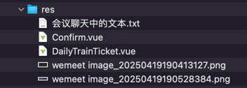

## res


## 会议聊天中的文本

```text
feat(web|business): 参考 web-admin 的余票信息，在 web 端也增加余票信息查询功能

-- -- --

<template #default="{ row }">
          <el-button 
            type="primary" 
            size="small" 
            @click="handleBook(row)"
          >
            预订
          </el-button>
        </template>

-- -- --

import { useRouter } from 'vue-router'
const router = useRouter()

-- -- --

router.push({
    path: '/confirm',
    query: {
      date: row.date,
      trainCode: row.trainCode,
      start: row.start,
      end: row.end,
      startTime: row.startTime,
      endTime: row.endTime,
      ydz: row.ydz,
      ydzPrice: row.ydzPrice,
      edz: row.edz,
      edzPrice: row.edzPrice,
      rw: row.rw,
      rwPrice: row.rwPrice,
      yw: row.yw,
      ywPrice: row.ywPrice
    }
  })
```