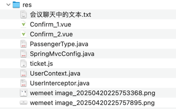

## res


## 会议聊天中的文本

```text
-- 乘车人/乘客
-- 乘车人不一定是网站的会员。比如你给爷爷奶奶等买票，他们只是单纯的乘车人身份
drop table if exists `cr_passenger`;
create table `cr_passenger`
(
    `id`          bigint      not null comment 'id',
    `user_id`     bigint      null comment '会员id',
    `name`        varchar(20) not null comment '姓名|searchable',
    `id_card`     varchar(18) not null comment '身份证号',
    `mobile`      varchar(11) comment '手机号',
    `type`        char(1)     not null comment '乘客类型|枚举[PassengerType]',
    `created_at` datetime(3) not null comment '创建时间',
    `updated_at` datetime(3) not null comment '更新时间',
    primary key (`id`),
    key `index_user_id` (`user_id`)
) default charset = utf8mb4 comment ='乘车人';

-- -- --

Avatar

-- -- --

interceptor

-- -- --

context

-- -- --

feat(common): 通过线程本地变量保存当前登录用户信息并增加 UserInterceptor

-- -- --

feat(user): 在 user 模块增加配置：启用 UserInterceptor

-- -- --

feat(user): 保存乘车人时，直接从线程本地变量获取 userId 并赋值

-- -- --

create database xxx_cr;
create database xxx_business;

-- -- --

import { useTicketStore } from '@/stores/ticket'
const ticketStore = useTicketStore()

-- -- --

// 存储车票信息到 store
ticketStore.setTicketInfo({
  date: row.date,
  trainCode: row.trainCode,
  start: row.start,
  end: row.end,
  startTime: row.startTime,
  endTime: row.endTime,
  ydz: row.ydz,
  ydzPrice: row.ydzPrice,
  edz: row.edz,
  edzPrice: row.edzPrice,
  rw: row.rw,
  rwPrice: row.rwPrice,
  yw: row.yw,
  ywPrice: row.ywPrice
})

-- -- --

// 跳转到确认页面
router.push('/confirm')

-- -- --

// 从 store 获取车票信息
if (!ticketStore.ticketInfo) {
  ElMessage.error('车票信息不存在')
  router.push('/ticket')
  return
}

ticketInfo.value = ticketStore.ticketInfo

-- -- --

// 清除store中的数据
ticketStore.clearTicketInfo()

-- -- --

reactor(web): 使用 Pinia 重构车票预订数据传递

- 新增 ticket store 用于管理车票预订数据
- 移除 URL 参数传递方式，改用 Pinia 状态管理
- 增加数据校验和错误处理
- 订单提交后自动清理 store 数据

主要改动：
1. 新增 web/src/stores/ticket.js
2. 修改 web/src/views/Ticket.vue 中的预订逻辑
3. 修改 web/src/views/Confirm.vue 中的数据获取方式

这次重构的好处：
- 数据安全性：不再通过 URL 暴露数据
- 代码可维护性：数据流更清晰

-- -- --

feat(web): Confirm 页面增加选择乘车人功能
```