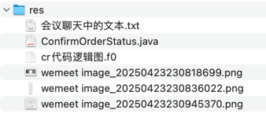

## res


## 会议聊天中的文本

```text
-- 确认订单
drop table if exists `confirm_order`;
create table `confirm_order`
(
    `id`                    bigint      not null comment 'id',
    `user_id`             bigint      not null comment '会员id',
    `date`                  date        not null comment '日期',
    `train_code`            varchar(20) not null comment '车次编号|searchable',
    `start`                 varchar(20) not null comment '出发站|searchable',
    `end`                   varchar(20) not null comment '到达站|searchable',
    `daily_train_ticket_id` bigint      not null comment '余票ID',
    `tickets`               json        not null comment '车票',
    `status`                char(1)     not null comment '订单状态|枚举[ConfirmOrderStatus]',
    `created_at`           datetime(3) comment '新增时间',
    `updated_at`           datetime(3) comment '修改时间',
    primary key (`id`),
    index `date_train_code_index` (`date`, `train_code`)
) comment ='确认订单';

-- -- --

Tickets

-- -- --

ConfirmOrderTicketRequest

-- -- --

/**
 * 乘客ID
 */
@NotNull(message = "【乘客ID】不能为空")
private Long passengerId;

/**
 * 乘客票种
 */
@NotBlank(message = "【乘客票种】不能为空")
private String passengerType;

/**
 * 乘客名称
 */
@NotBlank(message = "【乘客名称】不能为空")
private String passengerName;

/**
 * 乘客身份证
 */
@NotBlank(message = "【乘客身份证】不能为空")
private String passengerIdCard;

/**
 * 座位类型code
 */
@NotBlank(message = "【座位类型code】不能为空")
private String seatTypeCode;

/**
 * 选座，可空，值示例：A1
 */
private String seat;

-- -- --

feat(business): 手动增加 ConfirmOrderTicketRequest，封装用户确认订单之后传递过来的 tickets 数据

前端传递过来的 tickets 是 json 格式数据，在后端可以用 List<ConfirmOrderTicketRequest> 来封装它

并将 @NotBlank 校验改成 NotEmpty 校验

-- -- --

passengerIdCard: passenger.idCard,

-- -- --

dailyTrainTicketId: ticketInfo.value.id,

-- -- --

passengerIdCard: passenger.passengerIdCard,
seatTypeCode: passenger.seatType,

-- -- --

id: row.id,

-- -- --

feat(web): 调整前端在确认订单时需要提供的数据，与后端相匹配

-- -- --

ConfirmOrderController

-- -- --

@RestController
@RequestMapping("confirm-order")

-- -- --

feat(business): 后端提供 confirm-order/confirm 接口的代码轮廓

-- -- --

export function confirmOrder(data) {
  return http.post(MODULE_PREFIX + '/confirm-order/confirm', data)
}

-- -- --

import { confirmOrder } from '@/api/business/ticket.js'

-- -- --

// 提交订单
const submitOrder = async (confirmDate) => {
  loading.value = true
  try {
    const res = await confirmOrder(confirmDate)
    if (res.code === 200) {
      loading.value = false
      confirmLoading.value = false
      dialogVisible.value = false
      // 清除store中的数据
      ticketStore.clearTicketInfo()
      ElMessage.success('订单提交成功！')
    } else {
      // 场景：http 返回头的状态码是 200，但是返回体中的 code 字段值不是 200
      ElMessage.error(res.msg || '订单提交失败')
    }
  } catch (error) {
    ElMessage.error(error.response.data.msg || '订单提交失败')
  }
}

-- -- --

feat(business): 前端调用 confirm-order/confirm 接口

-- -- --

// 业务数据校验【暂略】如：车次、余票是否存在；车次是否有效；tickets 条数是否大于 0；同乘客同车次的票是否已经买过了

// 保存到【确认订单】表，订单状态赋初始值

// 查询【余票信息】获取真实的库存

// 预扣减余票数量，并判断余票是否足够

// 选座
    // 遍历车厢，获取每个车厢的座位数据
    // 选座：挑选符合条件的座位，如果这个车厢不满足，则进入下个车厢（隐藏条件：多个选座必须在同一个车厢）

// 选中座位后的事务处理：
    // 座位表修改售卖情况 sell 字段
    // 真实扣减库存，更新【余票信息】的余票
    // 记录会员的购票记录
    // 更新【确认订单】表的订单状态=成功
```