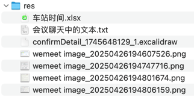

## res


## 会议聊天中的文本

```text
// 重置选座数据
selectedSeats.value = []

-- -- --

fix(web): 修正 Confirm 页面的按钮 loading 状态和窗口的显示状态，在 finally 语句块中恢复各种状态

-- -- --

feat(business): ConfirmOrderService@confirm - 4 - 选座0 - 识别用户是否主动选座

-- -- --

// 辅助：计算座位的相对偏移值，提高多个座位的选座效率

-- -- --

List<SeatCol> colEnumList = SeatCol.getColsByType(seatTypeCode);

-- -- --

log.info("本次选座的座位类型={}，包含的列={}", SeatType.getEnumByCode(seatTypeCode), colEnumList);

-- -- --

// 组成和前端一样的两排初始座位列表，用作参照的两排座位
List<String> referSeatList = new ArrayList<>();
for (int i = 1; i <= 2; i++) {
    for (SeatCol seatCol : colEnumList) {
        referSeatList.add(seatCol.getCode() + i);
    }
}
log.info("用作参照的两排座位={}", referSeatList);

-- -- --

// 绝对偏移值
List<Integer> aboluteOffsetList = new ArrayList<>();
List<Integer> offsetList = new ArrayList<>();
for (ConfirmOrderTicketRequest ticketReq : tickets) {
    int index = referSeatList.indexOf(ticketReq.getSeat());
    aboluteOffsetList.add(index);
}
log.info("计算得到所有座位的绝对偏移值；{}", aboluteOffsetList);
// 真正需要的偏移值（相对于第一个座位的偏移值）
for (Integer index : aboluteOffsetList) {
    int offset = index - aboluteOffsetList.getFirst();
    offsetList.add(offset);
}
log.info("计算得到所有座位相对第一个座位的偏移值={}", offsetList);

-- -- --

feat(business): ConfirmOrderService@confirm - 4 - 选座1 - 计算座位的相对偏移值

-- -- --

课堂动手时间

任务：
1. 找到之前讲过的漂亮稳定可扩展之 - “计算任何算法的运行时间”，先找到是哪一天讲的内容，从自己的 git 提交记录等等线索查找

2. 把这个逻辑，整理成类似今天画的这种图

下午上课的时候发到聊天

-- -- --

getSeat

-- -- --

log.info("查到符合条件(seatType={})的车厢数量={}", seatType, carriageList.size());

-- -- --

log.info("开始从序号={}的车厢选座", dailyTrainCarriage.getIndex());

-- -- --

log.info("车厢序号={}，座位数={}", dailyTrainCarriage.getIndex(), 0);

-- -- --

feat(business): ConfirmOrderService@confirm - 5 - 选座2 - 遍历车厢，获取每节车厢的座位信息

-- -- --

calSell

-- -- --

isChoose

-- -- --

如果有选座：根据之前计算好的【选座偏移值】可以一次性挑完
如果无选座：一个一个挑，遇到未售的就选中

-- -- --

column

-- -- --

/**
 * 计算某座位在区间内是否可卖
 * 例：sell=10001
 *   - 第一位1表示0～1（起始站到第二个站），第二位0代表1～2（第2个站到第3个站） ...
 *   - 这个值表示第 0(起始站)～1 卖出去了，第 4～5 卖出去了
 *   - 本次购买区间站 1~4，则区间已售 000
 * 全部是 0，表示这个区间可买；只要有 1，就表示区间内已售过票
 * <p>
 * 选中后，要计算购票后的 sell，比如原来是 10001，本次购买区间站 1~4
 * 方案：构造本次购票完成之后的新售卖信息 01110，和原来的 sell=10001【按位或】最终得到 11111
 */

-- -- --

sellPart

-- -- --

log.info("座位={}在本次车站区间={}~{}已出售，不可选", dailyTrainSeat.getCarriageSeatIndex(), startIndex, endIndex);

-- -- --

log.info("座位={}在本次车站区间={}~{}未出售，可选", dailyTrainSeat.getCarriageSeatIndex(), startIndex, endIndex);
```