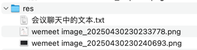

## res


## 会议聊天中的文本

```text
//  111,   111
String curSell = sellPart.replace('0', '1');
// 0111,  0111
curSell = StrUtil.fillBefore(curSell, '0', endIndex);
// 01110, 01110
curSell = StrUtil.fillAfter(curSell, '0', sell.length());

// 当前区间售票信息 curSell=01110 与数据库中已售信息 sell=00001 按位或，即可得到该座位卖出此票后的售票详情
// 15(01111), 14(01110 = 01110|00000)
int newSellInt = NumberUtil.binaryToInt(curSell) | NumberUtil.binaryToInt(sell);
//  1111,  1110
String newSell = NumberUtil.getBinaryStr(newSellInt);
// 01111, 01110
newSell = StrUtil.fillBefore(newSell, '0', sell.length());
log.info("座位={}被选中，原售票信息={}，车站区间={}~{}，即：{}，最终售票信息={}"
        , dailyTrainSeat.getCarriageSeatIndex(), sell, startIndex, endIndex, curSell, newSell);
// 现在只需要在内存中修改，并未更新到数据库
dailyTrainSeat.setSell(newSell);

-- -- --

feat(business): ConfirmOrderService@confirm - 6 - 选座3 - 计算某座位在区间内是否可卖 ...

提示：当前代码，在未选座的条件下会出现某个座位被重复选择的情况，不急，后续再解决

-- -- --

log.info("座位={} 列值不对，继续判断下一个座位，当前列值={}，目标列值={}", seatIndex, col, column);


-- -- --

// 判断列号 column，有值的情况下要对比列号，也就是【有选座】的情况

-- -- --

// 根据偏移值 offset 选择剩下的座位
boolean isGetAllOffsetSeat = true;
if (CollUtil.isNotEmpty(offsetList)) {
    log.info("有偏移值={}，根据偏移值校验座位是否可选", offsetList);
    // 从索引 1 开始，索引 0 就是当前已选中的票
    for (int j = 1; j < offsetList.size(); j++) {
        Integer offset = offsetList.get(j);
        int nextIndex = i + offset;

        // 额外判断：【有选座】的情况下，一定要在同一个车箱
        if (nextIndex >= seatList.size()) {
            log.info("座位={} 不可选，偏移后的索引超出了当前车厢的座位数={}", nextIndex, seatList.size());
            isGetAllOffsetSeat = false;
            break;
        }

        DailyTrainSeat nextDailyTrainSeat = seatList.get(nextIndex);
        boolean isChooseNext = calSell(nextDailyTrainSeat, startIndex, endIndex);
        if (isChooseNext) {
            log.info("座位={}被选中", nextDailyTrainSeat.getCarriageSeatIndex());
        } else {
            log.info("座位={}不可选", nextDailyTrainSeat.getCarriageSeatIndex());
            isGetAllOffsetSeat = false;
            break;
        }
    }
}
if (!isGetAllOffsetSeat) {
    continue;
}

// 保存选好的座位
return;

-- -- --

feat(business): ConfirmOrderService@confirm - 7 - 选座4 - 根据偏移值选择后面的座位

-- -- --

List<DailyTrainSeat> getSeatList = new ArrayList<>();

-- -- --

// 最终的选座结果
List<DailyTrainSeat> finalSeatList = new ArrayList<>();

-- -- --

// 未完全选中所有座位时，需要清空【临时的/可能不一定完整】的选座信息
getSeatList = new ArrayList<>();

-- -- --

log.info("最终的选座结果={}", finalSeatList);

-- -- --

// 一个车厢一个车厢的获取数据

-- -- --

// 换车厢时，需要清空【临时的/可能不一定完整】的选座信息 getSeatList
getSeatList = new ArrayList<>();

-- -- --

//判断当前的座位是否被选中过
boolean alreadyChooseFlag = false;
for (DailyTrainSeat finalSeat : finalSeatList) {
    if (finalSeat.getId().equals(dailyTrainSeat.getId())) {
        alreadyChooseFlag = true;
        break;
    }
}
if (alreadyChooseFlag) {
    log.info("座位={}在当前选座过程中已被选中过，不能重复选择，继续判断下一个座位", seatIndex);
    continue;
}

-- -- --

getSeatList.add(dailyTrainSeat);

-- -- --

getSeatList.add(nextDailyTrainSeat);

-- -- --

feat(business): ConfirmOrderService@confirm - 8 - 选座5 - 保存最终的选座结果 ...

并解决之前这个 commit【feat(business): ConfirmOrderService@confirm - 6 - 选座3 - 计算某座位在区间内是否可卖 ...】消息 body 中描述【某个座位被重复选择的情况】的问题

-- -- --

AfterConfirmOrderService

-- -- --

seatForUpdate

-- -- --

@Transactional

-- -- --

feat(business): ConfirmOrderService@confirm - 9 - 更新座位表的售卖情况 sell 字段 @Transactional
```