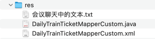

## res


## 会议聊天中的文本

```text
custom

-- -- --

private static final Logger log = LoggerFactory.getLogger(AfterConfirmOrderService.class);


-- -- --

log.info("完成：更新座位表的售卖情况 sell 字段");

-- -- --

Integer startIndex = dailyTrainTicket.getStartIndex();
Integer endIndex = dailyTrainTicket.getEndIndex();
char[] chars = seatForUpdate.getSell().toCharArray();
Integer maxStartIndex = endIndex - 1;
Integer minEndIndex = startIndex + 1;
int minStartIndex = 0;
for (int i = startIndex - 1; i >= 0; i--) {
    char aChar = chars[i];
    if (aChar == '1') {
        minStartIndex = i + 1;
        break;
    }
}
log.info("影响出发站区间：最小出发站index={} ~ 最大出发站index={}", minStartIndex, maxStartIndex);

int maxEndIndex = seatForUpdate.getSell().length();
for (int i = endIndex; i < seatForUpdate.getSell().length(); i++) {
    char aChar = chars[i];
    if (aChar == '1') {
        maxEndIndex = i;
        break;
    }
}
log.info("影响到达站区间：最小到达站index={} ~ 最大到达站index={}", minEndIndex, maxEndIndex);

dailyTrainTicketMapperCustom.updateCountBySell(
        dailyTrainSeat.getDate(),
        dailyTrainSeat.getTrainCode(),
        dailyTrainSeat.getSeatType(),
        minStartIndex,
        maxStartIndex,
        minEndIndex,
        maxEndIndex);
log.info("完成：真实扣减库存，更新【余票信息】的余票");

-- -- --

feat(business): ConfirmOrderService@confirm - 10 - *** 计算这个站的车票卖出去之后，影响了哪些相关站的余票库存；并更新所有相关库存
```