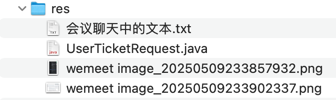

## res


## 会议聊天中的文本

```text
-- 会员车票
drop table if exists `ticket`;
create table `ticket`
(
    `id`             bigint      not null comment 'id',
    `user_id`        bigint      not null comment '会员id',
    `passenger_id`   bigint      not null comment '乘客id',
    `passenger_name` varchar(20) comment '乘客姓名|searchable',
    `train_date`     date        not null comment '日期',
    `train_code`     varchar(20) not null comment '车次编号',
    `carriage_index` int         not null comment '箱序',
    `seat_row`       char(2)     not null comment '排号|01,02...',
    `seat_col`       char(1)     not null comment '列号|枚举[SeatCol]',
    `start_station`  varchar(20) not null comment '出发站',
    `start_time`     time        not null comment '出发时间',
    `end_station`    varchar(20) not null comment '到达站',
    `end_time`       time        not null comment '到站时间',
    `seat_type`      char(1)     not null comment '座位类型|枚举[SeatType]',
    `created_at`    datetime(3) comment '新增时间',
    `updated_at`    datetime(3) comment '修改时间',
    primary key (`id`),
    index `user_id_index` (`user_id`)
) comment ='会员车票';

-- -- --

<dependency>
    <groupId>org.springframework.cloud</groupId>
    <artifactId>spring-cloud-starter-openfeign</artifactId>
</dependency>

-- -- --

UserFeign

-- -- --

@FeignClient(name = "user", url = "http://127.0.0.1:8081")

-- -- --

feign

-- -- --

FeignTicketController

-- -- --

@RestController
@RequestMapping("/feign/ticket")
public class FeignTicketController {

    @Autowired
    private TicketService ticketService;

    @PostMapping("/save")
    public R<Object> save(@Valid @RequestBody UserTicketRequest request) throws Exception {
        ticketService.save(request);
        return R.ok();
    }

}

-- -- --

UserTicketRequest

-- -- --

feat(user): 增加 feign.FeignTicketController save 接口，用于后续跨模块保存会员车票记录

-- -- --

@EnableFeignClients("com.example.cr.business.feign")

-- -- --

// 调用会员服务接口，为会员增加一条车票购买记录
UserTicketRequest userTicketRequest = new UserTicketRequest();
userTicketRequest.setUserId(UserContext.getId());
userTicketRequest.setPassengerId(tickets.get(j).getPassengerId());
userTicketRequest.setPassengerName(tickets.get(j).getPassengerName());
userTicketRequest.setTrainDate(dailyTrainTicket.getDate());
userTicketRequest.setTrainCode(dailyTrainTicket.getTrainCode());
userTicketRequest.setCarriageIndex(dailyTrainSeat.getCarriageIndex());
userTicketRequest.setSeatRow(dailyTrainSeat.getRow());
userTicketRequest.setSeatCol(dailyTrainSeat.getCol());
userTicketRequest.setStartStation(dailyTrainTicket.getStart());
userTicketRequest.setStartTime(dailyTrainTicket.getStartTime());
userTicketRequest.setEndStation(dailyTrainTicket.getEnd());
userTicketRequest.setEndTime(dailyTrainTicket.getEndTime());
userTicketRequest.setSeatType(dailyTrainSeat.getSeatType());
R<Object> responseFromUserModule = userFeign.save(userTicketRequest);
log.info("完成：跨服务调用 user 模块的接口，保存会员车票购买记录。返回={}", responseFromUserModule);

-- -- --

feat(user): 购票成功后，通过 feign 跨服务调用 user 模块的保存会员车票接口

-- -- --

interceptor

-- -- --

FeignRequestInterceptor

-- -- --

@Component
public class FeignRequestInterceptor implements RequestInterceptor {
    @Override
    public void apply(RequestTemplate template) {
        ServletRequestAttributes attributes = (ServletRequestAttributes) RequestContextHolder.getRequestAttributes();
        if (attributes != null) {
            String token = attributes.getRequest().getHeader("Authorization");
            if (token != null) {
                // 将 token 添加到 Feign 请求头
                template.header("Authorization", token);
            }
        }
    }
}

-- -- --

fix(business): *** 添加 Feign 请求拦截器，服务间传递 token

- 在 business 模块添加 FeignRequestInterceptor
- 实现服务间调用时的 token 传递
- 解决跨服务调用时用户信息丢失问题

主要改动：
1. 添加 FeignRequestInterceptor 拦截器
2. 从当前请求获取 Authorization token
3. 将 token 添加到 Feign 请求头中

这次改动解决了：
- 跨服务调用时用户信息丢失的问题
- UserContext 获取不到用户信息的问题
- 服务间安全认证的问题

-- -- --

/**
 * 当前登录的会员id
 */
Long userId;

-- -- --

confirmOrderForUpdate

-- -- --

log.info("完成：更新【确认订单】表的订单状态=成功");

-- -- --

feat(web): 购票成功之后跳转到【我的车票】页面

-- -- --

作业：
1. 该补的抓紧补，该回看的快速回看，总之必须把 cr 项目代码补完整
2. 通过图文笔记、自己的标注，辅助对 cr 项目的理解（f0、excalidraw、excel、其他形式等等...）
3. 以数据库的视角切入，那张图
```