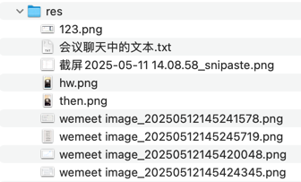

## res


## 会议聊天中的文本

```text
<el-form :inline="true">
  <el-form-item class="mb0">
    <el-date-picker
      v-model="selectedDate"
      type="date"
      value-format="YYYY-MM-DD"
      placeholder="选择日期"
    />
  </el-form-item>
  <el-form-item class="mb0">
    <el-button
      type="primary"
      :icon="Calendar"
      @click="handleGenDaily"
    >
      生成每日数据
    </el-button>
  </el-form-item>
</el-form>

-- -- --

// 日期选择
const selectedDate = ref(dayjs().add(15, 'day').format('YYYY-MM-DD'))

-- -- --

npm install dayjs

-- -- --

`确定要生成【${selectedDate.value}】的每日数据吗？`,
      '生成确认',

-- -- --
```