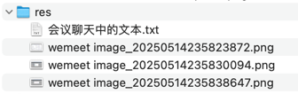

## res


## 会议聊天中的文本

```text
chore: 给所有核心模块配置 spring.application.name

-- -- --

nacos.io

-- -- --

<!-- https://github.com/alibaba/spring-cloud-alibaba/blob/2023.x/README-zh.md -->
<dependency>
    <groupId>com.alibaba.cloud</groupId>
    <artifactId>spring-cloud-alibaba-dependencies</artifactId>
    <version>2023.0.1.0</version>
    <type>pom</type>
    <scope>import</scope>
</dependency>

-- -- --

<!-- https://github.com/alibaba/spring-cloud-alibaba/blob/2023.x/spring-cloud-alibaba-examples/nacos-example/readme-zh.md -->
<dependency>
    <groupId>com.alibaba.cloud</groupId>
    <artifactId>spring-cloud-starter-alibaba-nacos-config</artifactId>
</dependency>
<dependency>
    <groupId>org.springframework.cloud</groupId>
    <artifactId>spring-cloud-starter-bootstrap</artifactId>
</dependency>

-- -- --

bootstrap.properties

-- -- --

# nacos 会根据这里配置的环境值，读不同的配置，例子：dataId: user-dev.properties
spring.profiles.active=dev
# 上面几个配置也可以不写，因为在 application.properties 或 application.yml 已经配置过

# nacos 配置中心 server 地址
spring.cloud.nacos.config.server-addr=127.0.0.1:8848
# 配置中心文件使用的配置文件后缀，默认 properties 也可以是 yml、json 等等，nacos 控制台也会有提示
spring.cloud.nacos.config.file-extension=properties

-- -- --

feat(user): 集成 Nacos 配置中心，并快速演示远程配置动态刷新的功能

关注代码变化、依赖变化、配图等

-- -- --

test(user): 测试多环境配置 + Nacos

-- -- --

chore(user): 讲解 Nacos 命名空间的推荐用法

-- -- --

spring.cloud.nacos.discovery.server-addr=127.0.0.1:8848

-- -- --

<dependency>
    <groupId>com.alibaba.cloud</groupId>
    <artifactId>spring-cloud-starter-alibaba-nacos-discovery</artifactId>
</dependency>

-- -- --

feat(user): 集成 Nacos 服务中心，并快速演示启动多个实例

-- -- --

<dependency>
    <groupId>org.springframework.cloud</groupId>
    <artifactId>spring-cloud-starter-bootstrap</artifactId>
</dependency>
<dependency>
    <groupId>com.alibaba.cloud</groupId>
    <artifactId>spring-cloud-starter-alibaba-nacos-discovery</artifactId>
</dependency>

-- -- --

feat(gateway): 网关模块也集成 Nacos 服务中心

-- -- --

Environment

-- -- --

<dependency>
    <groupId>org.springframework.cloud</groupId>
    <artifactId>spring-cloud-starter-loadbalancer</artifactId>
</dependency>

-- -- --

chore(gateway):引入负载均衡依赖，同时在配置中可以直接写上待转发服务在注册中心上的名称即可

不再需要写具体的 ip:端口了，这也代表着无论目标服务有几个实例都可以支持转发了

```