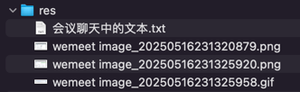

## res


## 会议聊天中的文本

```text
refactor(common|gateway|user): 把注册中心、配置中心、负载均衡、bootstrap依赖添加到 common 中

在 gateway 中主动排除不需要的依赖

-- -- --

chore(business|scheduler): business 和 scheduler 模块也增加 bootstrap.properties 配置文件，集成 Nacos 注册中心和配置中心

记得 重新 reload Maven，因为上一个 commit 修改了 common 模块的依赖

-- -- --

refactor(business|scheduler): 之前使用 openfeign 跨模块访问的地方，现在可以直接通过服务名互相调用

-- -- --

mybatis.configuration.log-impl=org.apache.ibatis.logging.stdout.StdOutImpl

-- -- --

test(business): 演示 MyBatis 一级缓存

-- -- --

test(business): *** 演示如何 MyBatis 二级缓存；需要被缓存的 Entity 记得实现 Serializable 接口

二级缓存是以 <mapper namespace="..."> 为单位。对这个 namespace 有增删改时，之前的二级缓存会失效

重要提示：由于 Entity 和 XxxMapper.xml 是自动生成的，本次操作修改了这些代码，重新自动生成时，记得再次修改；同时也说明这种方式有缺点，也不方便处理微服务多个实例的场景等等，后续会用 redis 来实现缓存

-- -- --
```