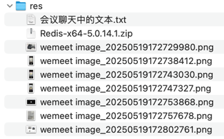

## res


## 会议聊天中的文本

```text
test(business): 演示 MyBatis 二级缓存失效的例子

-- -- --

refactor(business): 回滚之前演示 MyBatis 二级缓存的 Entity 和 Mapper 代码修改

原因之前的 commit 中也写过了，这里再补充一些：
1. 由于 Entity 和 XxxMapper.xml 是自动生成的，本次操作修改了这些代码，重新自动生成时，记得再次修改；同时也说明这种方式有缺点，也不方便处理微服务多个实例的场景，等等

2. MyBatis 缓存只能在 dao 层做缓存，如果先要在其他层，比如 service 层就没办法了，等等

3. 所以后续会用其他更灵活的方式来实现缓存，比如 redis

-- -- --

refactor: 删除 ***-data.sql 插入语句中的 "xxx." 增加灵活性

-- -- --

<dependency>
    <groupId>org.springframework.boot</groupId>
    <artifactId>spring-boot-starter-cache</artifactId>
</dependency>

-- -- --

feat(business): 演示 SpringBoot 默认缓存；记得 equals&hashCode ...

当前测试例子中 DailyTrainTicketListRequest 要重写 equals&hashCode 而且要考虑父类的字段

提醒：这种方式虽然比 MyBatis 灵活了，可以突破只能缓存持久层的缺陷，但是它依旧不太适合微服务多实例的场景。后续会用 redis

-- -- --

requirepass

-- -- --

<dependency>
    <groupId>org.springframework.boot</groupId>
    <artifactId>spring-boot-starter-data-redis</artifactId>
</dependency>

-- -- --

private static final Logger log = LoggerFactory.getLogger(TestController.class);

@Resource
RedisTemplate redisTemplate;

@RequestMapping("redis/set/{key}/{value}")
public String set(@PathVariable String key, @PathVariable String value) {
    redisTemplate.opsForValue().set(key, value, 3600, TimeUnit.SECONDS);
    log.info("set - key={}, value={}", key, value);
    return "success";
}

@RequestMapping("redis/get/{key}")
public Object get(@PathVariable String key) {
    Object object = redisTemplate.opsForValue().get(key);
    log.info("get - key={}, value={}", key, object);
    return object;
}

-- -- --

feat(business): 快速演示 SpringBoot 集成 Redis

-- -- --

feat(business): *** 修改缓存配置 spring.cache.type=redis 将缓存类型替换成 Redis

注意：
需要缓存的方法返回值类型需要 implements Serializable

补充：
改用 Redis 做业务缓存之后
1. 既可以提高访问速度，MySQL 单机 QPS 约 2000，Redis 约 10 万
2. 也可以解决微服务多实例的缓存数据一致性
3. 机器重启也不会丢失缓存数据

-- -- --
```