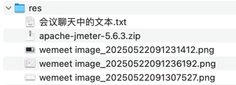

## res


## 会议聊天中的文本

```text
https://jmeter.apache.org/

-- -- --

<dependency>
    <groupId>org.redisson</groupId>
    <artifactId>redisson-spring-boot-starter</artifactId>
</dependency>

-- -- --

<dependency>
    <groupId>org.redisson</groupId>
    <artifactId>redisson-spring-boot-starter</artifactId>
    <version>3.44.0</version>
</dependency>

-- -- --

@Autowired
private RedissonClient redissonClient;

-- -- --

String lockKey = DateUtil.formatDate(request.getDate()) + "-" + request.getTrainCode();
RLock lock = redissonClient.getLock("CONFIRM_ORDER_" + lockKey);
try {
    // 尝试获取锁，最多等待 10 秒，如果超时则抛出异常
    boolean tryLock = lock.tryLock(10, TimeUnit.SECONDS);
    if (!tryLock) {
        // 走到这里只是代表没抢到锁，并不知道车票被抢完了没，所以提示用户：服务器忙，请稍候重试
        throw new CommonBusinessException("系统繁忙，请稍后重试");
    }
    // 抢到锁了！
    // 处理订单逻辑...
    // 如果有业务异常，直接抛出，不要catch
    doConfirm(request);
} catch (InterruptedException e) {
    // 获取锁被中断
    // 跟上面类似，走到这里只是代表没抢到锁，并不知道车票被抢完了没，所以提示用户：服务器忙，请稍候重试
    throw new CommonBusinessException("系统繁忙，请稍后重试");
} finally {
    // 只有当前线程持有锁时才能释放锁
    if (lock !=null && lock.isHeldByCurrentThread()) {
        lock.unlock();
    }
}

-- -- --

feat(business): 引入 redisson，利用 redis 的分布式锁解决多实例超卖问题

-- -- --
```