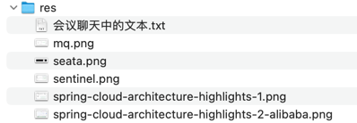

## res


## 会议聊天中的文本

```text
微服务组件之分布式事务 - Seata

https://seata.apache.org/zh-cn/docs/overview/what-is-seata

-- -- --

微服务组件之消息队列 - MQ - RocketMQ

https://rocketmq.apache.org/

-- -- --

微服务组件之流量治理 - Sentinel

流量治理、流量防护之常见限流算法
- 静态窗口限流
- 动态窗口限流
- 漏桶限流
- 令牌桶限流
  - 类似漏桶，都是桶，这不过这个桶放的是令牌，而非直接的流量。
    可以把“令牌”想象成只要拿到VIP的才有资格进来；或者只有提前预约成功的才有资格进来，不能直接来
- 令牌大闸
  - 令牌的总量有限

限流之后一般伴随着降级处理
  降级可以理解成：
    - 原本应该提供5星级服务，现在给你2星级
    - 原本应该坐在店内高档桌椅、吹空调、吃美食，现在降级成在门口坐小板凳、先喝点茶水；或者直接跟你说：先回去吧，明天再来

要会类比生活
其他代码就是生活

-- -- --

每一个组件都有不同的实现

面向“接口”编程

提升 Level

-- -- --

https://spring.io/cloud

https://sca.aliyun.com/

-- -- --
```