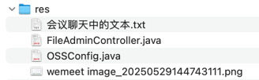

## res


## 会议聊天中的文本

```text
https://www.aliyun.com/product/oss

-- -- --

feat(cs): 增加公共服务模块 cs

-- -- --

chore(cs): 增加 cs 模块的描述信息 common service

-- -- --

chore(cs): 依赖自己写的 common 模块

-- -- --

feat(cs): 手写启动类 CsApplication

-- -- --

feat(cs): 增加多环境配置

-- -- --

feat(cs): 增加 TestController 和对应的 test.http

-- -- --

feat(cs): 由于依赖了 common 模块，记得在启动类中增加 @ComponentScan 覆盖默认扫描路径(error)

- 在 cs 模块中默认扫描组件的路径是启动类所在的包以及子包

- 想要扫描到 common 模块的组件，需要把包路径加大，或者通过 @Import 的方式精准注入

- 当前代码状态还会有错，因为现在能扫描到 common 模块的组件了，但是 common 模块中的 UserInterceptor 依赖了 CustomJWTUtils 组件，这个组件有额外配置条件限制 @ConditionalOnProperty(name = "jwt-secret-key") 需要在配置文件中存在 jwt-secret-key 配置

-- -- --

feat(cs): 增加 CustomJWTUtils 需要的配置

-- -- --

<dependency>
    <groupId>com.aliyun.oss</groupId>
    <artifactId>aliyun-sdk-oss</artifactId>
    <version>3.17.4</version>
</dependency>
<dependency>
    <groupId>javax.xml.bind</groupId>
    <artifactId>jaxb-api</artifactId>
    <version>2.3.1</version>
</dependency>

-- -- --

# 单个文件大小限制
spring.servlet.multipart.max-file-size=500MB
# 单次请求总文件大小限制
spring.servlet.multipart.max-request-size=580MB

-- -- --

alibaba.cloud.oss.endpoint=oss-cn-xxx.aliyuncs.com
alibaba.cloud.oss.access-key=your-access-key
alibaba.cloud.oss.secret-key=your-secret-key
alibaba.cloud.oss.bucket=your-bucket

-- -- --
```